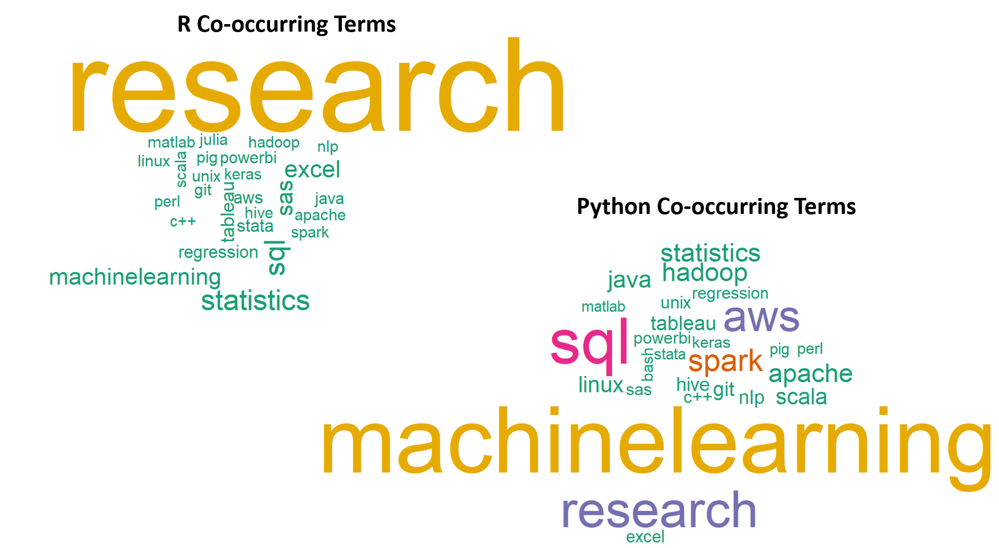

```{css, echo=FALSE}
# CSS for including pauses in printed PDF output (see bottom of lecture)
@media print {
  .has-continuation {
    display: block !important;
  }
}
.remark-code-line {
  font-size: 95%;
}
.small {
  font-size: 75%;
}
.scroll-output-full {
  height: 90%;
  overflow-y: scroll;
}
.scroll-output-75 {
  height: 75%;
  overflow-y: scroll;
}
```

```{r setup, include=FALSE}
options(htmltools.dir.version = FALSE)
library(knitr)
knitr::opts_chunk$set(
	fig.align = "center",
	cache = FALSE,
	dpi = 300,
  warning = F,
  message = F,
	fig.height = 5,
	out.width = "80%"
)
```

# Table of contents

1. [About R](#R)

1. [Operators](#operators)

1. [Objects and functions](#objects)

1. [Data frames](#data-frames)

1. [Vectors](#vectors)

1. [Miscellaneous basics](#misc)


---
class: inverse, middle
name: R

# About R

---

#	Why are we using R in this course?

-	It’s free and open source

- It’s widely used in industry

- It’s widely used in academic research

- It has a large and active user community

--

</br>
**Compared with Stata:**

- More of a true programming language

- Steeper learning curve (takes more to get started, but ultimately more powerful)

- Many advantages I'll point out throughout the course


---

# R vs. Python

**R:**
- Built for statistics and data analysis
- Better at econometrics and data visualization

**Python:**
- Built for general-purpose programming and software development
- Better at machine learning

```{r, out.width="60%", echo=F}

```
[(Source)](https://towardsdatascience.com/r-vs-python-comparing-data-science-job-postings-seeking-r-or-python-specialists-2c39ba36d471)

---

# R vs. Python

**R:**
- Built for statistics and data analysis
- Better at econometrics and data visualization

**Python:**
- Built for general-purpose programming and software development
- Better at machine learning

Most economists use either Stata or R

Many data scientists in industry use both R and Python

Rising competitor to both: Julia

---

# R is a means, not an end

- The goals of this course are **platform-agnostic**
  *	It’s not about the syntax of specific packages
  *	It’s about the concepts, logic, and thought processes underlying what we're doing and why

- Your eventual goal: **Use the right tool for the job**

--

</br>
- Personally, I probably still have a bit more expertise in Stata than R

- Many of you will know more than me about some of the things we’re learning about
  *	Please speak up and share!

---

# R and RStudio

- R is like the car's engine

- RStudio is the dashboard

---

# Getting to know RStudio

1. **Tour of panes:** Console, environment, scripts, other stuff

1. **Try out the console**
  * Use it as a calculator
  * Access previous commands

1. **Try a new script and save it**

1. **Set global options (Tools -> Options)**
  * Uncheck "Restore .RData into workspace at start"
  * Set "Save workspace to .RData on exit" to "Never"

1. **Keyboard shortcuts**

---

# Time for some live coding

Open a **new R script.**

As we go through examples, **retype everything yourself and run it line by line** (ctl+enter). You'll learn more this way.

(Feel free to try out slight tweaks along the way, too.)


---
class: inverse, middle
name: operators

# Operators

---

# Basic arithmetic

You can use R like a fancy graphing calculator:
```{r}
1 + 2 # Addition
6 - 7 # Subtraction
5 / 2 # Division
2 ^ 3 # Exponentiation
2 + 4 * 1 ^ 3 # Standard order of operations
```

---

# Logical evaluation

Logical operators follow standard programming conventions:
```{r}
1 > 2
1 > 2 & 1 > 0.5 # The "&" means "and"
1 > 2 | 1 > 0.5 # The "|" means "or"
```

Negation:
```{r}
!(1 > 2)
```

---

# Commenting

R ignores the rest of a line after a `#`. So you can write notes to yourself about what your code is doing.

```{r}
# Test whether 4 is greater than 3
4 > 3
```

</br>
Widely accepted conventions:
- Put the comment **before** the code it refers to.
- Use present tense.


---

# Evaluation

This doesn't work, because `=` is reserved for assignment:
```{r, error=T}
1 = 1
```

Instead, use **==**:
```{r}
1 == 1
```

For "not equal", use **!=**:
```{r}
1 != 2  # This looks weird because of the font
```

Note: **Read the error message!** 
--
What should you do if you don't understand it?


---
class: inverse, middle
name: objects

# Objects and functions

---

# Objects

We can store values for later by assigning them to **objects.**
```{r}
bill = 18.45
percentage = 0.2
```

Instead of **=**, you can use **<-** (and many people do):
```{r}
bill <- 18.45  # this font turns "<" and "-" into a symbol
percentage <- 0.2
```

In this course, I will use `=` for assignment. You can use either one, but be consistent.

---

# Objects

To see the value of an object, just type its name:
```{r}
bill
```

Notice that `bill` and `percentage` are now listed in your Environment pane.

Now, we can calculate the tip:
```{r}
bill * percentage
```

Assign a new value to `bill` and recalculate the tip:
```{r}
bill = 90
bill * percentage
```

---

# Challenge

Try on your own, and compare your solution with a neighbor:

**Calculate the sum of the first 100 positive integers.**

Hint: The formula for the sum of integers $1$ through $n$ is $n(n+1)/2$.

--
 
Solution:
```{r}
n = 100
n * (n + 1) / 2
```


---

# Using functions

Doing anything more complicated than arithmetic requires **functions.**
```{r}
log(50)
```
To find out what **arguments** a function takes, look up its help file.
```{r, eval=F}
?log
```

Some arguments are required, some are optional. You can see that `base` is optional because it has a default value: `exp(1)`.

If you type the arguments in the expected order, you don't need to use argument names:
```{r}
log(50, 10)
```

---

# Using functions

But using argument names can help improve clarity:
```{r}
log(50, base = 10)
```

If you name all the arguments, you can put them in any order:
```{r}
log(base = 10, x = 50)
```

We can use objects as arguments, or nest functions:
```{r}
log(bill)
log(exp(50))
```

---

# Data types

There are many different types of objects:
- vectors (numeric, character, logical, integer)
- matrices
- data frames
- lists
- functions

To know what type of object you have, use `class`:
```{r}
a = 2
class(a)
class("a")
class(TRUE)
```

---
class: inverse, middle
name: data-frames

# Data frames

---

# Packages

Many of the most useful functions of R come from add-on **packages.**

To install the package called `dslabs`, type:
```{r, eval=F}
install.packages("dslabs")
```

You only need to install a package on your computer once. But you still need to load it each time you open RStudio:
```{r}
library(dslabs)
```

Load the dataset `murders` from this package:
```{r}
data(murders)
```


---

# Data frames

A data frame is like a table. Each row is an observation and each column is a variable.

```{r}
class(murders)
```

To learn more about an data frame, you can:

(1) Examine its **str**ucture with `str`:
```{r}
str(murders)
```

---

# Data frames

(2) Display some summary statistics with `summary`:
```{r}
summary(murders)
```

---

# Data frames

(3) Show the first few rows with `head`:
```{r}
head(murders)
```

(4) Directly inspect it with `View` (or just click on it in your Environment pane)
```{r, eval=F}
View(murders)
```

---

# The accessor ($)

To refer to individual variables (columns) in this data frame, we can use `$`:
```{r}
murders$population
```

The object `murders$population` is a **vector**, a set of numbers.

How many entries (rows) does it have?
```{r}
length(murders$population)
```

---

# Basic plots

Make a quick **histogram:**
```{r}
hist(murders$total)
```

---

# Basic plots

Make a quick **scatterplot:**
```{r, eval=F}
plot(x = murders$population, y = murders$total)
with(murders, plot(x = population, y = total))  # These lines are equivalent
```
```{r, echo=F, fig.height = 4.5}
plot(x = murders$population, y = murders$total)
```


---
class: inverse, middle
name: interlude

# Interlude

---

# Cleaning up

You *could* remove objects from your environment (R's memory) using `rm`:
```{r}
a = "hi"
rm(a)
```

But generally it's better to just **start a new R session.** (Try this now.)

* Your environment is transient. Don't get attached to objects in it.

* Exit R when you're done working. Never save your environment.

* To re-create objects later, plan to re-run your script.

* When you need to keep something, save it to a file (we'll get to this soon).


---

# Download these slides

Link: [github.com/msu-econ-data-analytics/course-materials](https://github.com/msu-econ-data-analytics/course-materials)

Try to keep typing all the code yourself. **But also open these slides** in case you temporarily fall behind or want to go back to a previous slide yourself.

These slides are written in R Markdown (.Rmd file), which we'll cover in a couple weeks. You can look at either the .html (slides) or .Rmd (source) file.

* I like to create my own "reference script" where I collect all the new functions I'm learning and annotate/comment them as I go.


---
class: inverse, middle
name: vectors

# Vectors

---

# Vectors

Vectors are the most basic objects in R. `a = 1` produces a vector of length 1.

To create longer vectors, use `c()`, for "concatenate":
```{r}
codes = c(380, 124, 818)
countries = c("italy", "canada", "egypt")
class(codes)
class(countries)
```

In R, you can use either single or double quotes:
```{r}
countries = c('italy', 'canada', 'egypt')
```

--

Why doesn't it work to type `countries = c(canada, spain, egypt)`?


---

# Names

We can name the entries of a vector (with or without quotes):
```{r}
codes = c(italy = 380, canada = 124, egypt = 818)
codes
codes = c("italy" = 380, "canada" = 124, "egypt" = 818)
codes
```

Or by using the `names` function:
```{r}
codes = c(380, 124, 818)
country = c("italy", "canada", "egypt")
names(codes) = country
codes
```

---

# Sequences

Another useful way to create vectors is to generate sequences:
```{r}
seq(1, 10)
```

Shortcut for consecutive integers:
```{r}
1:10
```

Counting by 5s:
```{r}
seq(5, 50, 5)
```

---

# Subsetting/Indexing

We use square brackets to access specific elements of a vector:
```{r}
codes[2]
```

You can get more than one entry by using a multi-entry vector as an index:
```{r}
codes[c(1,3)]
```

Sequences are useful if we want to access, say, the first two elements:
```{r}
codes[1:2]
```

---

# Subsetting/Indexing

You can also index using names, if they're defined:
```{r}
codes["canada"]
```

And you can assign new values to indexed elements:
```{r}
codes[2] = 125
codes
```


---

# Challenge

```{r, eval=F}
library(dslabs)
data(murders)
```

Change the name of the column "total" to be "murders", and then change it back to "total". (Hint: use `names()` and indexing.)

--
 
Solution:
```{r}
names(murders)[5] = "murders"
head(murders)
names(murders)[5] = "total"
```


---

# Converting (coercing) types

Turn numbers into characters, and back again:
```{r}
x = 1:5
y = as.character(x)
y
as.numeric(y)
```

---

# Converting (coercing) types

A vector can't mix and match types, so R will just guess:
```{r}
z = c(1, "canada", 3)
z
class(z)
```

If a conversion isn't obvious to R, you'll get an `NA` ("not available"):
```{r}
as.numeric(z)
```

---

# Special values

In R, `NA` contains no information.
```{r}
NA == NA
NA + 0
is.na(NA + 0)
```

`NA` values are very important in representing missing data.

---

# Special values

Other special values in R:
```{r}
1/0
-1/0
0/0
```

---

# Vector arithmetic

Arithmetic operators apply **element-wise.**

$$
\small{
\begin{pmatrix}
a\\
b\\
c\\
d
\end{pmatrix}
+
\begin{pmatrix}
e\\
f\\
g\\
h
\end{pmatrix}
=
\begin{pmatrix}
a +e\\
b + f\\
c + g\\
d + h
\end{pmatrix}
}
$$

Multiply a vector by a scalar:
```{r}
inches = 1:12
cm = inches * 2.54
cm
```

Divide (the elements of) one vector by (the elements of) another:
```{r}
murder_rate = murders$total / murders$population * 1e5
mean(murder_rate)
```


---

# An aside on data frames

We could add the murder rate to our data frame as a new variable (column):

```{r}
murders$rate = murders$total / murders$population * 1e5
head(murders)
```

But this isn't always the best approach to editing data frames. Why?

--

* The syntax is redundant and gets complicated quickly.
* It directly modifies your original data frame, rather than creating a new version.
* If there is already a column named `rate`, it gets overwritten.

---

# An aside on data frames

One potentially better approach uses `cbind` to create a new object:
```{r, echo = F}
murders = murders[1:5]
```
```{r}
murders_with_rate = cbind(murders, murder_rate)
head(murders_with_rate)
```

What should you make sure to watch out for when using `cbind`?


---

# Subsetting with logicals

It's often useful to **subset** a vector based on the properties of another vector.

Generate a logical vector that says whether each element of a vector passes a test:
```{r}
low = murder_rate <= 0.6  # this is "< =" without a space
low
```

---

# Subsetting with logicals

Now we can subset (index) states using this logical:
```{r}
murders$state[low]
```

How many states meet this test? `sum` coerces logical to numeric, treating `TRUE` as 1 and `FALSE` as 0:
```{r}
sum(low)
```

---

# Challenge

Try this on your own, and compare with a neighbor:

**Which state has the most murders?**

Hint: Use logical indexing and the `max` function.

--
 
Solution:

```{r}
most = max(murders$total)
is_most = (murders$total == most)
murders$state[is_most]
```

Or, in one line:

```{r}
murders$state[murders$total == max(murders$total)]
```

Which syntax is better?


---
class: inverse, middle
name: misc

# Miscellaneous basics

---

# A useful trick: %in%

Is Montana listed as a state in this dataset?
```{r}
"Montana" %in% murders$state
```

How about D.C. and Puerto Rico?
```{r}
c("District of Columbia", "Puerto Rico") %in% murders$state
```

---

# Lists

Lists are objects that can store any combination of types.
```{r}
record = list(
  name = "John Doe",
  id = 1234,
  grades = c(94, 88, 95)
  )
record
```

**FYI:** A data frame is a list of vectors that follows certain rules.

---

# Lists

Access the components with `$` as usual, or with double square brackets:
```{r}
record$id
record[["id"]]
record[[2]]
record$grades[3]
```


---

# Table of contents

1. [About R](#R)

1. [Operators](#operators)

1. [Objects and functions](#objects)

1. [Data frames](#data-frames)

1. [Vectors](#vectors)

1. [Miscellaneous basics](#misc)

