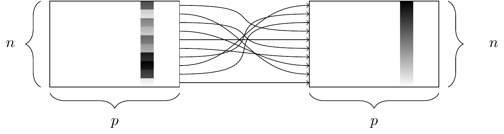

name: toc

```{css, echo=FALSE}
# CSS for including pauses in printed PDF output (see bottom of lecture)
@media print {
  .has-continuation {
    display: block !important;
  }
}
.small {
  font-size: 90%;
}
.smaller {
  font-size: 80%;
}

```

```{r setup, include=FALSE}
options(htmltools.dir.version = FALSE)
library(knitr)
knitr::opts_chunk$set(
	fig.align = "center",
	cache = TRUE,
	dpi = 300
)
```

# Agenda for the next 2-3 weeks

**Where we've been:**

1. R Basics

1. Programming

1. Productivity tools

<br>
**Where we're going:**

1. Data wrangling in the tidyverse

1. Data cleaning

1. Introduce the term project

1. Data acquisition & webscraping

---

# Table of contents

1. [Tidyverse basics](#basics)

1. [Data wrangling with dplyr](#dplyr)

1. [Joining data with dplyr](#joins)

1. [Data tidying with tidyr](#tidyr)

1. [Summary](#summary)


---
class: inverse, middle
name: basics

# Tidyverse basics

---

# The tidyverse

**A whole "universe" of functions within R**
- The most powerful, intuitive, and popular approach to data cleaning, wrangling, and visualization in R

**Advantages:**
- Consistent philosophy and syntax
- "Verb" based approach makes it more familiar to users of Stata/SAS/SPSS
- Serves as the front-end for many other big data and ML tools

**Why did I make you learn base R to start with?**
- The tidyverse can't do everything
- The best solution to many problems involves a combination of tidyverse and base R
- Ultimately you want to learn about many tools and choose the best one for the job

.footnote[
Note: Another approach with many fans is [**data.table**](http://r-datatable.com/), which you can learn about on your own!
]

---

# Tidyverse vs. base R

There is often a direct correspondence between a tidyverse command and its base R equivalent. 

| tidyverse  |  base |
|---|---|
| `?readr::read_csv`  | `?utils::read.csv` |
|  `?dplyr::if_else` |  `?base::ifelse` |
|  `?tibble::tibble` |  `?base::data.frame` |

Notice these generally follow a `tidyverse::snake_case` vs `base::period.case` rule.

The tidyverse alternative typically offers some enhancements or other useful options (and sometimes restrictions) over its base counterpart.
- Remember: There are always multiple ways to achieve a single goal in R.


---

# Tidying Data

The two most important properties of tidy data are:

1. Each column is a variable.
2. Each row is an observation.


Tidy data is easier to work with, because you have a consistent way of referring to variables and observations. It then becomes easy to manipulate, visualize, and model.

---

# Wide vs. Long Formats

Both of these data sets display information on heart rate observed in individuals across 3 different time periods:

```{r echo=FALSE}
wide = data.frame(
  name = c("Wilbur", "Petunia", "Gregory"),
  time1 = c(67, 80, 64),
  time2 = c(56, 90, 50),
  time3 = c(70, 67, 101)
)
wide

long = data.frame(
  name = c("Wilbur", "Petunia", "Gregory", "Wilbur", "Petunia", "Gregory", "Wilbur", "Petunia", "Gregory"),
  time = c(1, 1, 1, 2, 2, 2, 3, 3, 3),
  heartrate = c(67, 80, 64, 56, 90, 50, 70, 67, 10)
)
long
```

Which dataframe is in *tidy* format?

---

# Wide vs. Long Formats

**Wide** data:
- Row = patient. Columns = repeated observations over time.
- Often easier to take in at a glance (as in a spreadsheet).

**Long** data:
- Row = one observation. Columns = ID variables + observed variable.
- Usually easier to clean, merge with other data, and avoid errors.

Tidy data is more likely to be **long**.
- Most R packages have been written assuming your data is in long format.

"Tidy datasets are all alike but every messy dataset is messy in its own way." \
– Hadley Wickham


---

# Tidyverse packages

We need to install and load a couple of packages. Run these preliminaries:

```{r, eval=F}
install.packages('tidyverse')
install.packages('nycflights13')
library(tidyverse)
```
```{r tverse, cache = F, echo=F}
library(tidyverse)
```

--

We see that we have actually loaded a number of packages (which could also be loaded individually): **ggplot2**, **tibble**, **dplyr**, etc.
- We can also see information about the package versions and some [namespace conflicts](https://raw.githack.com/uo-ec607/lectures/master/04-rlang/04-rlang.html#59).

---

# Tidyverse packages

The tidyverse actually comes with a lot more packages than those that are just loaded automatically.
```{r tverse_pkgs}
tidyverse_packages()
```

All of these are super useful
- **lubridate** helps us work with dates
- **rvest** is for webscraping

This lecture will focus on two that are automatically loaded: **dplyr** and **tidyr**.

---

# Pipes: |> or %>%

Pipes take the **output** of one function and feed it into the **first argument** of the next (which you then skip).

`dataframe |> filter(condition)` is equivalent to `filter(dataframe, condition)`.

Note: `|>` on these slides is generated by the two characters `| >`, without the space.

--

<br>
**Older version** of the pipe: `%>%`
* From the `magrittr` package loaded with the tidyverse
* Works identically to `|>` in most situations.

<br>
**Keyboard shortcut:** Ctl/Cmd + Shift + M

* Have to turn on a setting in RStudio options to make `|>` the default

---

# Pipes: |> or %>%

Pipes can dramatically improve the experience of reading and writing code. Compare:

.small[
```{r, eval = F}
## These next two lines of code do exactly the same thing.

mpg |> filter(manufacturer=="audi") |> group_by(model) |> summarize(hwy_mean = mean(hwy))

summarize(group_by(filter(mpg, manufacturer=="audi"), model), hwy_mean = mean(hwy))
```
]

The first line reads from left to right, exactly how you think about the operations.

The second line totally inverts this logical order (the final operation comes first!) 

---

# Pipes: |> or %>%

Best practice is to put each function on its own line and indent. Look how much more readable this is:

```{r pipe}
mpg |> 
  filter(manufacturer == "audi") |> 
  group_by(model) |> 
  summarize(hwy_mean = mean(hwy))
```

Vertical space costs nothing and makes for much more readable/writable code than cramming things horizontally.

All together, this multi-line line of code is called a **pipeline**.


---
class: inverse, middle
name: dplyr

# dplyr

---

# Key dplyr verbs

**There are five key dplyr verbs that you need to learn.**

1. `filter`: Filter (i.e. subset) rows based on their values.

2. `arrange`: Arrange (i.e. reorder) rows based on their values.

3. `select`: Select (i.e. subset) columns by their names: 

4. `mutate`: Create new columns.

5. `summarize`: Collapse multiple rows into a single summary value.<sup>1</sup>

.footnote[
<sup>1</sup> Many sources spell `summarise` with an "s" -- either one works!
]

--

</br>

Let's practice these functions together using the `starwars` data frame that comes pre-packaged with dplyr. 

---

# 1) dplyr::filter


---

# 1) dplyr::filter

We can chain multiple filter commands with the pipe (`|>`), or just separate them within a single filter command using commas.
```{r filter1}
starwars |> 
  filter( 
    species == "Human", 
    height >= 190
    ) 
```

---

# 1) dplyr::filter

Regular expressions work well too.
```{r filter2}
starwars |> 
  filter(grepl("Skywalker", name))
```

---

# 1) dplyr::filter

A very common `filter` use case is identifying (or removing) missing data cases. 
```{r filter3}
starwars |> 
  filter(is.na(height))
```

--

To remove missing observations, simply use negation: `filter(!is.na(height))`.\
Try this yourself.

---

# 2) dplyr::arrange



---

# 2) dplyr::arrange

`arrange` sorts your data frame by a particular column (numerically, or alphabetically)

```{r arrange1, warning=F}
starwars |> 
  arrange(birth_year)
```

---

# 2) dplyr::arrange

We can also arrange items in descending order using `arrange(desc())`.
```{r arrange2}
starwars |> 
  arrange(desc(birth_year))
```

---

# 3) dplyr::select


---

# 3) dplyr::select

Use commas to select multiple columns out of a data frame. (You can also use "first:last" for consecutive columns). Deselect a column with "-".
```{r select1}
starwars |> 
  select(name:skin_color, species, -height)
```

---

# 3) dplyr::select

You can also rename some (or all) of your selected variables in place.
```{r select2}
starwars |>
  select(alias=name, crib=homeworld) 
```

--

If you just want to rename columns without subsetting them, you can use `rename`. Try this!

---

# 3) dplyr::select

The `select(contains(PATTERN))` option provides a nice shortcut in relevant cases.
```{r select3}
starwars |> 
  select(name, contains("color"))
```

---

# 4) dplyr::mutate


---

# 4) dplyr::mutate

You can create new columns from scratch, or (more commonly) as transformations of existing columns.
```{r mutate1}
starwars |> 
  select(name, birth_year) |>
  mutate(dog_years = birth_year * 7) |>
  mutate(comment = paste0(name, " is ", dog_years, " in dog years."))
```

---


# 4) dplyr::mutate

*Note:* `mutate` is order aware. So you can chain multiple mutates in a single call.
```{r mutate2}
starwars |> 
  select(name, birth_year) |>
  mutate(
    dog_years = birth_year * 7,     # Separate with a comma
    comment = paste0(name, " is ", dog_years, " in dog years.")
    )
```

---

# 4) dplyr::mutate

Boolean, logical and conditional operators all work well with `mutate` too.
```{r mutate3}
starwars |> 
  select(name, height) |>
  filter(name %in% c("Luke Skywalker", "Anakin Skywalker")) |> 
  mutate(tall1 = height > 180) |>
  mutate(tall2 = ifelse(height > 180, "Tall", "Short"))

```

---

# 4) dplyr::mutate

Lastly, combining `mutate` with `across` allows you to easily perform the same operation on a subset of variables.

```{r, mutate4}
starwars |> 
  select(name:eye_color) |> 
  mutate(across(where(is.character), toupper))
```

---

# 5) dplyr::summarize


---

# 5) dplyr::summarize

Particularly useful in combination with the `group_by` command.
```{r summ1}
starwars |> 
  group_by(species) |> 
  summarize(mean_height = mean(height))
```

---

# 5) dplyr::summarize

Notice that some of these summarized values are missing. If we want to ignore missing values, use `na.rm = T`:
```{r summ2}
## Much better
starwars |> 
  group_by(species) |> 
  summarize(mean_height = mean(height, na.rm = T))
```

---

# 5) dplyr::summarize

The same `across`-based workflow that we saw with `mutate` a few slides back also works with `summarize`. For example:

```{r, summ4}
starwars |> 
  group_by(species) |> 
  summarize(across(where(is.numeric), mean, na.rm=T))
```

---

# Other dplyr goodies

`ungroup`: For ungrouping after using `group_by`.
- Use after doing your grouped `summarize` or `mutate` operation, or everything else you do will be super slow.

--

`slice`: Subset rows by position rather than filtering by values.
- E.g. `starwars |> slice(1:10)`

--

`pull`: Extract a column from as a data frame as a vector or scalar.
- E.g. `starwars |> filter(sex=="female") |> pull(height)`

--

`count` and `distinct`: Number and isolate unique observations.
- E.g. `starwars |> count(species)`, or `starwars |> distinct(species)`
- You could also use `group_by` and `summarize` with `n()`:

```{r, eval=F}
starwars |> group_by(species) |> summarize(num = n())
```


---

# Challenge

Take a few minutes to try this on your own:

**List the most common eye colors among female Star Wars characters in descending order of frequency.**


<!-- No really, try it on your own before scrolling further!! -->


--

As usual, there are multiple solutions.

.pull-left[
```{r}
starwars |>
  filter(sex == "female") |>
  count(eye_color) |>
  arrange(desc(n))
```
]
.pull-right[
```{r}
starwars |> 
  filter(sex == "female") |>
  group_by(eye_color) |> 
  summarize(n = n()) |>
  arrange(desc(n))
```
]

---

# Storing results in memory

So far we haven't been saving the dataframes that result from our code in memory. Usually, we will want to use them for the next task.

Solution: Create a new object each time you write a pipeline.

```{r, eval=FALSE}
women = starwars |> filter(sex == "female")
brown_eyed_women = women |> filter(eye_color == "brown")
```

Sometimes it's convenient to use the same object name, to avoid cluttering up your data environment. But I don't recommend doing this with the the original dataframe (this is called **clobbering**).

```{r, eval=FALSE}
# DON'T do this
starwars = starwars |> filter(sex == "female")
```

--

By keeping multiple copies of very similar dataframes, will you waste your computer's memory? Nope -- R is smart and stores only the changes between objects.

---
class: inverse, middle
name: joins

# Joins

---

# Joining operations

Most data analysis requires combining information from multiple data tables. To combine tables, we use **joins** (similar to `base::merge()`).


--

There are multiple types of joins.

An **inner join** returns a dataframe of all rows that appear in both x and y.
- It keeps *only* rows that appear in both tables.

---

# Joining operations

.pull-left[
An **inner join** returns a dataframe of all rows that appear in both x and y.
- It keeps *only* rows that appear in both tables.

A **left join** keeps all rows in x.
- For matched rows, it merges in the values of y
- For unmatched rows, it fills in NA values for the variables coming from y.

A **right join** keeps all rows in y.
- Same as a left join, just reversed.

A **full join** keeps all rows in x and y.
]
.pull-right[

]

---

# Joining operations

**Left joins are safer than inner joins**
- It's too easy to lose observations with inner joins
- Left joins preserve all the original observations

**Use the left join** unless you have a strong reason to prefer another.

--

</br>

For the examples that I'm going to show here, we'll need some data sets that come bundled with the [**nycflights13**](http://github.com/hadley/nycflights13) package. 
- Load it now and then inspect these data frames on your own (click on them in your Environment pane).
- Pay attention to what the `year` column means in each data frame.

```{r flights, echo = F}
library(nycflights13)
```
```{r, eval = F}
library(nycflights13)
data(flights)
data(planes)
```

---

# Joining operations

Let's perform a left join on the flights and planes datasets.

```{r join1, eval=F}
flights |> 
  left_join(planes)
```
```{r join2, echo=FALSE}
flights |> 
  left_join(planes) |>
  select(year, month, day, dep_time, arr_time, carrier, flight, tailnum, type, model)
```

---

# Joining operations

(*continued from previous slide*)

Note that dplyr made a reasonable guess about which columns to join on (i.e. columns that share the same name). It also told us its choices: 

```
*## Joining, by = c("year", "tailnum")
```

**What's the problem here?**

--

The variable "year" does not have a consistent meaning across our joining datasets!
- In one it refers to the *year of flight*, in the other it refers to *year of construction*.

--

Luckily, there's an easy way to avoid this problem. 
- Can you figure it out? Try `?dplyr::join`.


---

# Joining operations

(*continued from previous slide*)

You just need to be more explicit in your join call by using the `by = ` argument.
- You can also rename any ambiguous columns to avoid confusion. 
```{r join3, eval=F}
flights %>% 
  left_join(
    planes |> rename(year_built = year),
    by = "tailnum"
    )
```
```{r join4, echo=FALSE}
left_join(
  flights,
  planes |> rename(year_built = year),
  by = "tailnum"
  ) |>
  select(year, month, day, dep_time, arr_time, carrier, flight, tailnum, year_built, type, model) |>
  head(3)
```


---
class: inverse, middle
name: tidyr

# tidyr

---

# Key tidyr verbs

1. `pivot_longer`: Pivot wide data into long format.

2. `pivot_wider`: Pivot long data into wide format.

3. `separate`: Separate (i.e. split) one column into multiple columns.

4. `unite`: Unite (i.e. combine) multiple columns into one.

--

</br>

Which of `pivot_longer` vs `pivot_wider` produces "tidy" data?
  
---

# 1) tidyr::pivot_longer

```{r pivot_longer1}
stocks = data.frame( ## Could use "tibble" instead of "data.frame" if you prefer
  time = as.Date('2009-01-01') + 0:1,
  X = rnorm(2, 10, 1),
  Y = rnorm(2, 10, 2),
  Z = rnorm(2, 10, 5)
  )
stocks
tidy_stocks = stocks |> 
  pivot_longer(cols=X:Z, names_to="stock", values_to="price")
tidy_stocks
```

---

# 2) tidyr::pivot_wider

Now we can use pivot_wider to go back to the original dataframe:

```{r pivot_wider1, dependson=tidy_stocks}
tidy_stocks |> pivot_wider(names_from=stock, values_from=price)
```

Or, we can put it into a new ("transposed") format, in which the observations are stocks and the columns are dates:

```{r pivot_wider2, dependson=tidy_stocks}
tidy_stocks |> pivot_wider(names_from=time, values_from=price)
```


---

# 3) tidyr::separate

`separate` helps when you have more than one value in a single column:

```{r sep1}
economists = data.frame(name = c("Adam_Smith", "Paul_Samuelson", "Milton_Friedman"))
economists
economists |> separate(name, c("first_name", "last_name")) 
```

--

This command is pretty smart. But to avoid ambiguity, you can also specify the separation character with the `sep` argument:

```{r, eval=F}
economists |> separate(name, c("first_name", "last_name"), sep = "_")
```


---

# 3) tidyr::separate

A related function is `separate_rows`, for splitting up cells that contain multiple fields or observations:
```{r sep2}
jobs = data.frame(
  name = c("Jack", "Jill"),
  occupation = c("Homemaker", "Philosopher, Philanthropist, Troublemaker")
  ) 
jobs
# Now split out Jill's various occupations into different rows
jobs |> separate_rows(occupation)
```

---

# 4) tidyr::unite

```{r unite1}
gdp = data.frame(
  yr = rep(2016, times = 4),
  mnth = rep(1, times = 4),
  dy = 1:4,
  gdp = rnorm(4, mean = 100, sd = 2)
  )
gdp 
## Combine "yr", "mnth", and "dy" into one "date" column
gdp |> unite(date, c("yr", "mnth", "dy"), sep = "-")
```

---

# 4) tidyr::unite

Note that `unite` will automatically create a character variable. You can see this better if we convert it to a tibble. 
```{r unite2}
gdp_u = gdp |> unite(date, c("yr", "mnth", "dy"), sep = "-") |> as_tibble()
gdp_u
```

---

# 4) tidyr::unite

If you want to convert it to something else (e.g. date or numeric) then you will need to modify it using `mutate`. This example uses the [lubridate](https://lubridate.tidyverse.org/) package's super helpful date conversion functions.

```{r unite3, message=F}
library(lubridate)
gdp_u |> mutate(date = ymd(date))
```


---

# Challenge

**Using `nycflights13`, create a table of average arrival delay (in minutes) by day (in rows) and carrier (in columns).**

Hint: Recall that you can tabulate summary statistics using `group_by` and `summarize`:
```{r}
flights |> 
  group_by(carrier) |> 
  summarize(avg_late = mean(arr_delay, na.rm=T))
```


<!-- Hey! Don't look! -->


---

# Challenge

**Using `nycflights13`, create a table of average arrival delay (in minutes) by day (in rows) and carrier (in columns).**

Solution:
```{r message=FALSE}
delay_long = flights |> 
  group_by(carrier, day) |> 
  summarize(avg_late = mean(arr_delay, na.rm=T))
delay_wide = delay_long |> 
  pivot_wider(names_from=carrier, values_from=avg_late)
head(delay_wide, 4)
```

Is this data frame tidy?

---
class: inverse, middle
name: summary

# Summary

---

# Key verbs

.pull-left[
### dplyr
1. `filter`
2. `arrange`
3. `select`
4. `mutate`
5. `summarize`
]
.pull-right[
### tidyr
1. `pivot_longer`
2. `pivot_wider`
3. `separate`
4. `unite`
]

</br>

### Also
* Pipes (`|>`)
* Grouping (`group_by`)
* Joining (`left_join`)
