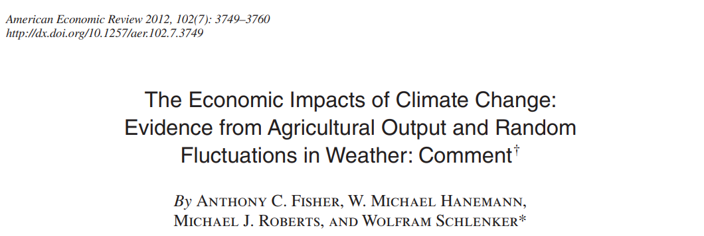
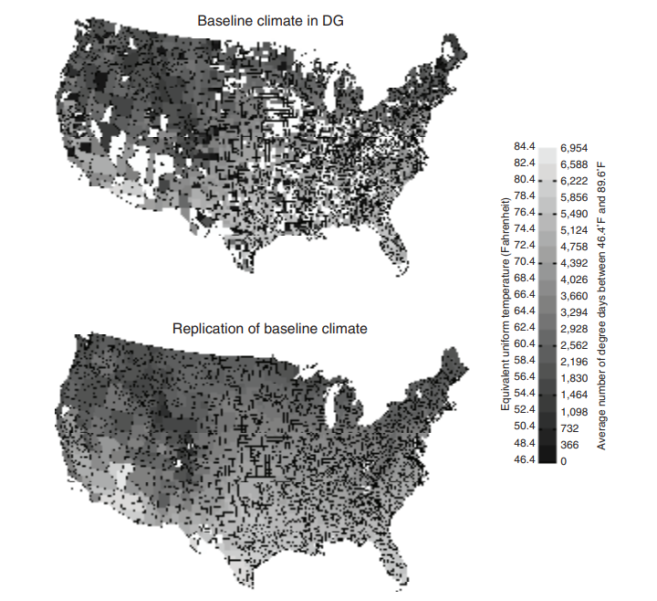

name: toc

```{css, echo=FALSE}
# CSS for including pauses in printed PDF output (see bottom of lecture)
@media print {
  .has-continuation {
    display: block !important;
  }
}
```

```{r setup, include=FALSE}
options(htmltools.dir.version = FALSE)
library(knitr)
knitr::opts_chunk$set(
	fig.align = "center",
	cache = TRUE,
	dpi = 300
)
```

# Table of contents

1. [The perils of bad data cleaning](#perils)

1. [Transparency and reproducibility](#transparency)

1. [Best practices](#best)


---
class: inverse, middle
name: perils

# The perils of bad data cleaning

---

# The perils of bad data cleaning

Published in the *American Economic Review* (2007):


---

# The perils of bad data cleaning



> *DG's baseline climate measure (dd89_7000) has a value of zero degree days for 163 counties. If correct, this measure implies temperatures do not exceed 8°C (46.4°F) in those counties during the growing season of April through September. Temperatures this low would seem implausible in any state, yet many of these counties are in warm southern states such as Texas.*

---

# The perils of bad data cleaning

```{r, out.width="75%", echo=F}

```

---

# The perils of bad data cleaning


> *Contrary to the results in DG (2007), the corrected data suggest that an immediate shift to the projected end-of-the-century climate would reduce agricultural profits.*


---
class: inverse, middle
name: transparency

# Transparency and Reproducibility

---

# Transparency and reproducibility

Avoiding errors is only the first step. It's also critical to make your work **reproducible.**

In the **private sector,** the benefits may be more obvious.
- Your code has to work together with other people's code.
- Eventually, someone else will take over your code.

In **academic research,** it's equally important.
- To trust the results -- many research findings fail to replicate.
- To build on your work and collaborate with others.
- Many journals now require a full "replication package" of data and code. 
- The push for transparency and reproducibility is known as the **open science** movement.

**Reproducibility:** Can someone else run your code and get the exact same results?

**Replication:** If another analyst attempts the same question, do they get the same answer?

**Transparency:** Can everyone see what choices you made and how you got your results?


---
class: inverse, middle
name: best

# Best Practices

Draws upon:
- Gentzkow & Shapiro (2014). *Code and Data for the Social Sciences: A Practitioner's Guide.*
- Ristovska, Ljubica (2019). *Coding for Economists: A Language-Agnostic Guide.*
- Wilson, Greg, et al. (2014). *Best Practices for Scientific Computing.*


---

# General principles

1. Make things easier for your future self (or collaborators).

1. Don't trust your future self.

.right[*(Ristovska 2019)*]


--

</br>

**Six topics:**
1. Code organization
1. File organization
1. Version control
1. Abstraction
1. Commenting
1. Unit tests


---

# 1. Organize your code

*"Programs are meant to be read by humans and only incidentally for computers to execute."*   
-- Donald Knuth

1. **Break** programs into short scripts or functions, each of which conducts a single task.

1. Make **names** distinctive and meaningful.

1. **Be consistent** with code style and formatting.
  - Directory structure
  - Code and comment style
  - File naming conventions
  - Variable naming conventions
  - Output data structure

Why?
- Your own working memory is limited.
- You will forget everything in 1-2 weeks.
- Your collaborators need to be able to easily understand your code.

---

# 2. Organize your files

1. Separate directories by function.

2. Separate files into inputs and outputs.

3. Use relative filepaths (`"../input/data.csv"` instead of `"C:/build/input/data.csv"`).

4. Define your working directory interactively.

Why?
- Easily find what you're looking for.
- Protect your raw data from being saved over.
- Others can run your code on their own computer with minimal changes.

---

# 2. Organize your files

The folder structure I like to use:
```{r, eval=F}
/my_project
  /raw
  /code
    /1_clean
    /2_process
    /3_results
  /prepped
  /output
    /tables
    /figures
  /temp
```

In the main folder (root directory), place:
* A **README** file that gives a basic overview of your project.
* A **master script** that lists and runs all other scripts.

---

# 3. Use some kind of version control

**Make incremental changes and test them as you go.**

If you aren't yet convinced of the benefits of using Git...

...at least save new copies of your scripts:
- Every time you make a substantial revision.
- If you make *any* edits to a script you haven't touched in more than 1-2 weeks.

You can archive these old versions in a subfolder, e.g., `/old/2021-10-21/`.

---

# 4. Abstract (don't repeat yourself)

Don't copy-and-paste. Instead, **abstract**.

E.g. functions, loops, vectorization.

Why? Reduces scope for error.
- What if you copy-and-paste, later find a bug and correct it once, but forget the other instance?

Cost/benefit analysis with an externality to your future self
- Consider... once? 4 times? 500 times?
- Value of saved time, but also preventing errors and improving readability.

---

# 4. Abstract (don't repeat yourself)

But also don't go nuts...


.small[Image from xkcd ([source](https://xkcd.com/1319/)) and not included in the CC license.]

---

# 4. Abstract (don't repeat yourself)

**Give every piece of information one single authoritative representation in the project.**
- E.g., physical constants, parameter settings, filepaths.
- Define them once, not in every script.

**Never hard-code anything that has any possibility of changing later.**
- E.g. the result of one section is later used in another section.
- Save it by assigning it to an object.


---

# 5. Comment often to explain purpose

**Basic:** Write lots of comments to explain what's going on. Comment every 5-10 lines or more.

Focus on documenting **the objectives** of the code, rather than **how** it works.

```{r, eval=F}
# Delete all instances of "Bhai" and "Ben" at the end of the name variable
MIS2 = MIS |> mutate(name_std = str_replace_all(name, "(BHAI|BEN)$", ""))
```

But why?? Explain the purpose instead:

```{r, eval=F}
# Create "standardized" names that omit honorifics
MIS2 = MIS |> mutate(name_std = str_replace_all(name, "(BHAI|BEN)$", ""))
```

---

# 5. Comment often to explain purpose

**Advanced:** Try to eliminate the *need* for most comments.
- Write modular code; use descriptive variable names; abstract when appropriate.

**Write self-documenting code:**

1. Use descriptive, unambiguous variable names
   - `income_percapita` instead of `income_pc`
   - RStudio's autocomplete feature gives you no excuses

1. Define everything explicitly, and don't be afraid to write more code than necessary.

---

# 5. Comment often to explain purpose

Example:
```{r, eval=F}
area_1000acres = area_m2*247.105/1000000000
```

Huh?

--

Try this instead:
```{r, eval=F}
# Define unit conversions
m2_per_km2 = 1000^2
acres_per_km2 = 247.105

# Convert units
area_km2 = area_m2 / m2_per_km2
area_acres = area_km2 * acres_per_km2
area_1000acres = area_acres / 1000
```


---

# 6. Test your code frequently

**Assume you will make mistakes.** (You will. All the time. You're a human, not a computer.)
- Software developers spend ~50% of their time on debugging, testing, and validation.

Debugging is the easy part -- the computer forces you to do it.

**Testing** is different from debugging. The code runs, but is it correct?

1. Test every step of your code.
   - What is the code supposed to be doing?
   - Look at the output and make sure it's doing that.

1. Write assertions and unit tests.
   - Extra code to verify that inputs and outputs conform to expectations.
   - In R, use `stopifnot()`.

1. Turn bugs into test cases.


---

# Summary

1. [The perils of bad data cleaning](#perils)

1. [Transparency and reproducibility](#transparency)

1. [Best practices](#best)
