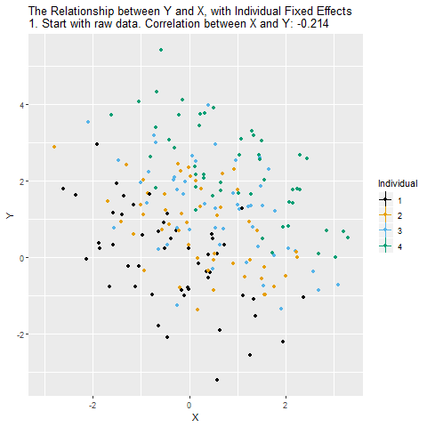
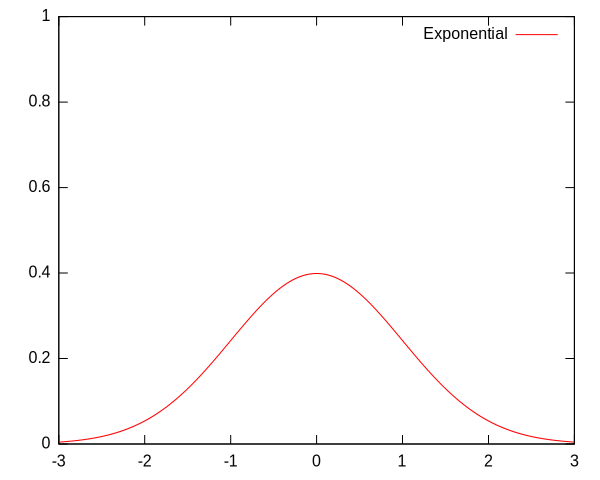

name: toc

```{css, echo=FALSE}
# CSS for including pauses in printed PDF output (see bottom of lecture)
@media print {
  .has-continuation {
    display: block !important;
  }
}
.remark-code-line {
  font-size: 95%;
}
.small {
  font-size: 75%;
}
.medsmall {
  font-size: 90%;
}
.scroll-output-full {
  height: 90%;
  overflow-y: scroll;
}
.scroll-output-75 {
  height: 75%;
  overflow-y: scroll;
}
```

```{r setup, include=FALSE}
options(htmltools.dir.version = FALSE)
library(knitr)
library(tidyverse)
knitr::opts_chunk$set(
	fig.align = "center",
	cache = TRUE,
	dpi = 300,
  warning = F,
  message = F
)
```

# Table of contents

1. [Describing relationships](#xy)

1. [Conditional expectations](#cef)

1. [Adjusting for other variables](#adjusting)

1. [Smoothing](#smooth)


---
class: inverse, middle
name: challenge

# A brief challenge

---

# Challenge

Load this data:

```{r}
puzzle = read_csv("https://bit.ly/3B4BraF")
```

</br>

**Using your exploratory analysis skills, find the most important thing about this dataset.**

---

# Challenge

```{r, fig.height=5.5, message=FALSE, warning=FALSE, out.width="70%", eval=F}
ggplot(puzzle, aes(x, y)) +
  geom_point(size=4)
```
--
```{r echo=FALSE, fig.height=5.5, message=FALSE, warning=FALSE, out.width="70%"}
ggplot(puzzle, aes(x, y)) +
  geom_point(size=4)
```


---
class: inverse, middle
name: xy

# Describing relationships

---

# Anscombe's Quartet

All 4 of these datasets have the same means, standard deviations, correlation coefficient, linear regression line, and regression R-squared.

```{r echo=FALSE, fig.height=4.5, message=FALSE, warning=FALSE, out.width="70%"}
anscombe_tidy = anscombe %>%
  pivot_longer(everything(),
   names_to = c(".value", "set"),
   names_pattern = "(.)(.)"
 )
ggplot(anscombe_tidy, aes(x, y)) + 
  geom_point(size=3) + 
  facet_wrap(~set)
```

**Always plot your data!** Don't rely on summary statistics alone.

---

# Scatterplots

Long before you run a regression, you should be looking at the scatterplots.

```{r, fig.height=4.1, message=FALSE, warning=FALSE, out.width="80%"}
vienna = read_csv("https://osf.io/y6jvb/download")

ggplot(vienna, aes(x=rating_count, y=price)) + 
  geom_point()
```

---

# Scatterplots

Transformations are often extremely important to learning what's really going on.

```{r, fig.height=4.2, message=FALSE, warning=FALSE, out.width="80%"}
vienna = vienna %>% mutate(ln_price = log(price),
                           ln_rating_count = log(rating_count))
ggplot(vienna, aes(x=ln_rating_count, y=ln_price)) + 
  geom_point()
```

---

# Scatterplots

Another example of how helpful transformations can be.

```{r, fig.height=3.5, message=FALSE, warning=FALSE, out.width="80%"}
library(gapminder)
gap07 = gapminder %>%
  filter(year==2007) %>%
  mutate(gdp = pop * gdpPercap)
ggplot(gap07, aes(x=pop, y=gdp)) +
  geom_point()
```

---

# Scatterplots

Another example of how helpful transformations can be.

```{r, fig.height=3.5, message=FALSE, warning=FALSE, out.width="80%"}
gap07 = gap07 %>%
  mutate(ln_gdp = log(gdp),
         ln_pop = log(pop))

ggplot(gap07, aes(x=pop, y=ln_gdp)) +
  geom_point()
```

---

# Scatterplots

Another example of how helpful transformations can be.

```{r, fig.height=3.5, message=FALSE, warning=FALSE, out.width="80%"}
gap07 = gap07 %>%
  mutate(ln_gdp = log(gdp),
         ln_pop = log(pop))

ggplot(gap07, aes(x=ln_pop, y=ln_gdp)) +
  geom_point()
```

---

# Binscatter

When you have a lot of data, scatterplots get too crowded to be useful!

Download this data scraped from Airbnb for listings in London on the night of 4 March 2017.

```{r, fig.height=3.5, message=FALSE, warning=FALSE, out.width="80%"}
london = read_csv("https://osf.io/ey5p7/download")
london2 = london %>%
  mutate(ln_price = log(price))
ggplot(london2, aes(x=longitude, y=ln_price)) +
  geom_point()
```

---

# Binscatter

An extremely useful alternative is the **binscatter** plot.

Binscatter divides your X variable into "bins" and plots the mean of Y within each bin.

---

# Binscatter

First, create the bins. They can be equally spaced or equally sized (quantiles).
- Quantiles are preferred, so each bin represents the same amount of underlying data.
```{r, fig.height=3.5, message=FALSE, warning=FALSE, out.width="80%"}
london2 = london2 %>%
  mutate(longitude_bins = factor(ntile(longitude, 50)))
ggplot(london2, aes(x=longitude, y=ln_price, color=longitude_bins)) +
  geom_point()
```

---

# Binscatter

Then, calculate the means of both X and Y within each bin.
```{r, fig.height=3.5, message=FALSE, warning=FALSE, out.width="80%"}
london3 = london2 %>%
  group_by(longitude_bins) %>%
  mutate(ln_price_binned = mean(ln_price, na.rm=TRUE),
         longitude_binned = mean(longitude, na.rm=TRUE))
ggplot(london3) +
  geom_point(aes(x=longitude, y=ln_price, color=longitude_bins)) +
  geom_point(aes(x=longitude_binned, y=ln_price_binned), size=2)
```

---

# Binscatter

Let's show just the binned points:

```{r, fig.height=3.5, message=FALSE, warning=FALSE, out.width="80%"}
london_binned = london2 %>%
  group_by(longitude_bins) %>%
  summarize(across(c("ln_price", "longitude"), mean, na.rm=TRUE))
ggplot(london_binned, aes(x=longitude, y=ln_price)) +
  geom_point(size=3)
```

---

# Binscatter

Easier: Use `binsreg` ([Cattaneo, Crump, Farrell, and Feng 2021](https://arxiv.org/abs/1902.09608))
- Correctly handles many of the finer statistical details.

```{r, eval=FALSE}
install.packages("binsreg")
```
```{r, fig.height=3.5, message=FALSE, warning=FALSE, out.width="80%"}
library(binsreg)
binsreg(london2$ln_price, london2$longitude)
```

---

# Local regression

A useful alternative to binscatter is **local regression.**

Local regression gives a smooth line that closely resembles the binscatter plot. What does it do exactly? We'll come back to this.

```{r, fig.height=3.5, message=FALSE, warning=FALSE, out.width="80%"}
ggplot(london3, aes(x=longitude, y=ln_price)) +

  geom_smooth()
```

---

# Local regression

A useful alternative to binscatter is **local regression.**

Local regression gives a smooth line that closely resembles the binscatter plot. What does it do exactly? We'll come back to this.

```{r, fig.height=3.5, message=FALSE, warning=FALSE, out.width="80%"}
ggplot(london3, aes(x=longitude, y=ln_price)) +
  geom_point(aes(x=longitude_binned, y=ln_price_binned), size=2) +
  geom_smooth()
```

---

# Linear regression (OLS)

You can also add the **line of best fit**, aka the **least-squares regression line.**

Clearly this is more useful in some situations than others.

```{r, fig.height=3.7, message=FALSE, warning=FALSE, out.width="80%"}
ggplot(london3, aes(x=longitude, y=ln_price)) +
  geom_point(aes(x=longitude_binned, y=ln_price_binned), size=2) +
  geom_smooth(method="lm", formula=y~x)
```

---

# Linear regression (OLS)

You can also add the **line of best fit**, aka the **least-squares regression line.**

Clearly this is more useful in some situations than others.

```{r, fig.height=3.6, message=FALSE, warning=FALSE, out.width="80%"}
london3 %>% filter(longitude > -0.16) %>%
  ggplot(aes(x=longitude, y=ln_price)) +
    geom_smooth(method='lm', formula=y~x) +
    geom_point(aes(x=longitude_binned, y=ln_price_binned), size=2)
```


---
class: inverse, middle
name: cef

# Conditional Expectations

Images and code in this section are from ["Why Regression?"](https://github.com/edrubin/EC607S21/tree/master/notes-lecture/03-why-regression) by Ed Rubin, used with permission, and are not included under this resource's overall CC license.

---

# The Conditional Expectation Function (CEF)

The CEF tells us the **expected value** (population mean) of an outcome variable $Y_i$ at each value of $X_i$.
$$ \mathbb{E}[Y_i|X_i] $$

Examples:
- $\mathbb{E}[\text{Price}_i|\text{Longitude}_i]$
- $\mathbb{E}[\text{Income}_i|\text{Education}_i]$
- $\mathbb{E}[\text{Birth weight}_i|\text{Air pollution}_i]$

</br>

Binscatter and local regression give **nonparametric estimates** of the CEF.
- Nonparametric: functional form is not pre-specified but rather driven by the data.


---
class: clear, middle, center

The conditional distributions of $\text{Y}_{i}$ for $\text{X}_{i}=x$ in 8, ..., 22.

```{R, data_cef, echo = F, cache = T}
library(ggridges)
library(ggthemes)
library(viridis)
# Set seed
set.seed(12345)
# Sample size
n <- 1e4
# Generate extra disturbances
u <- sample(-2:2, size = 22, replace = T) * 1e3
# Generate data
cef_df <- tibble(
  x = sample(x = seq(8, 22, 1), size = n, replace = T),
  y = 15000 + 3000 * x  + 1e3 * (x %% 3) + 500 * (x %% 2) + rnorm(n, sd = 1e4) + u[x]
) %>% mutate(x = round(x)) %>%
filter(y > 0)
# Means
means_df <- cef_df %>% group_by(x) %>% summarize(y = mean(y))
# The CEF in ggplot
gg_cef <- ggplot(data = cef_df, aes(x = y, y = x %>% as.factor())) +
  geom_density_ridges_gradient(
    aes(fill = ..x..),
    rel_min_height = 0.003,
    color = "white",
    scale = 2.5,
    size = 0.3
  ) +
  scale_x_continuous(
    "Annual income",
    labels = scales::dollar
  ) +
  ylab("Years of education") +
  scale_fill_viridis(option = "magma") +
  theme_pander(base_family = "Fira Sans", base_size = 18) +
  theme(
    legend.position = "none"
  ) +
  coord_flip()
```

```{r, echo = F, cache = T, fig.height = 7, fig.width = 10.5}
gg_cef
```

---
class: clear, middle, center

The CEF, $\mathop{E}\left[ \text{Y}_{i}\mid \text{X}_{i} \right]$, connects these conditional distributions' means.

```{R, echo = F, cache = T, fig.height = 7, fig.width = 10.5}
gg_cef +
  geom_path(
    data = means_df,
    aes(x = y, y = x %>% as.factor(), group = 1),
    color = "white",
    alpha = 0.85
  ) +
  geom_point(
    data = means_df,
    aes(x = y, y = x %>% as.factor()),
    color = "white",
    shape = 16,
    size = 3.5
  )
```

---
class: clear, middle, center

Focusing in on the CEF, $\mathop{E}\left[ \text{Y}_{i}\mid \text{X}_{i} \right]$...

```{R, fig_cef_only, echo = F, cache = T, fig.height = 7, fig.width = 10.5}
gg_cef_focus = ggplot(data = cef_df, aes(x = y, y = x %>% as.factor())) +
  geom_density_ridges(
    rel_min_height = 0.003,
    color = "grey85",
    fill = NA,
    scale = 2.5,
    size = 0.3
  ) +
  scale_x_continuous(
    "Annual income",
    labels = scales::dollar
  ) +
  ylab("Years of education") +
  scale_fill_viridis(option = "magma") +
  theme_pander(base_family = "Fira Sans", base_size = 18) +
  theme(
    legend.position = "none"
  ) +
  geom_path(
    data = means_df,
    aes(x = y, y = x %>% as.factor(), group = 1),
    color = "grey20",
    alpha = 0.85
  ) +
  geom_point(
    data = means_df,
    aes(x = y, y = x %>% as.factor()),
    color = "grey20",
    shape = 16,
    size = 3.5
  ) +
  coord_flip()
gg_cef_focus
```

---

# The Conditional Expectation Function

A well-chosen CEF is (almost) everything you need for empirical work.

- For **prediction:** the CEF is the best predictor of $Y_i$ given $X_i$.
  - In the sense of minimizing mean squared error (bias squared plus variance).

- For **causal inference:** when the variation in $X$ is as-good-as-random, then the CEF shows how $X$ causally affects $Y$.
  - Specifically, the slope of the CEF is the **average causal response** of $Y$ to a 1-unit change in $X$, for each value of $X$.

--

</br>

So... **why are we always running regressions??**


---

# Why Use Regression?

**Regression provides the best linear approximation of the CEF.**

- Again, "best" in the sense of lowest possible mean squared error.

Regression is a **good way to summarize the CEF,** even when the CEF is not linear.
- Your regression can be useful even if it is not a literally correct model of the true data generating process.
- But, different regressions may be more or less useful (better or worse approximations of the CEF).

How useful is *your* regression in *your* situation?
- Look at a nonparametric estimate of your CEF to see if your regression is a good approximation.
- That is: binscatter or local regression.

---
class: clear, center, middle

Adding the population regression function

```{R, fig_reg_cef2, echo = F, cache = T, fig.height = 7, fig.width = 10.5}
# Estimate the relationship
cef_lm <- lm(y ~ x, data = cef_df)
# Find the regression points
lm_df <- tibble(
  x = 8:22,
  y = predict(object = cef_lm, newdata = data.frame(x = 8:22))
)
# Figure
gg_cef_focus +
  geom_path(
    data = lm_df,
    aes(x = y, y = x %>% as.factor(), group = 1),
    alpha = 0.5,
    color="orange",
    size = 2
  )
```

---

# Why Use Regression?

</br>

**My view:** Most times you run a regression, it should only be to confirm, quantify, and calculate standard errors for the information you have *already* learned about the underlying CEF.

</br>

What if linear regression is not a good approximation to the CEF?
- You can always add nonlinear *terms* to a regression to improve the approximation.
- Doesn't change the fact that regression provides a linear *approximation*, in the sense that all the terms enter the model in a linear combination.


---
class: inverse, middle
name: adjusting

# Adjusting for other variables

---

# Simpson's Paradox

A trend in a full dataset can disappear or even reverse when looking at the constituent groups individually.

```{r, out.width="67%", echo=F}
include_graphics("img/Simpsons_paradox_-_animation.gif")
```

Which trend is the "right" one?

.small[Image from [Wikipedia](https://commons.wikimedia.org/wiki/File:Simpsons_paradox_-_animation.gif) and used under [CC BY-NC-SA 4.0](https://creativecommons.org/licenses/by-nc-sa/4.0/).]

---

# The Simpsons Paradox

A trend in a full dataset can disappear or even reverse when looking at the constituent groups individually.

```{r, out.width="67%", echo=F}
include_graphics("img/the-simpsons-paradox.jfif")
```
.small[Image from [RJ Andrews @infowetrust](https://twitter.com/infowetrust/status/984536880199876608) and not included in the CC license.]

---

# The Simpsons Pair O' Docs

A trend in a full dataset can disappear or even reverse when looking at the constituent groups individually.

```{r, out.width="73%", echo=F}
include_graphics("img/the-simpsons-pair-o-docs.jfif")
```
.small[Image from [RJ Andrews @infowetrust](https://twitter.com/infowetrust/status/984536880199876608) and not included in the CC license.]

---

# Adjusting for a binary variable

Let's go back to the `gapminder` data and plot life expectancy by GDP:

```{r, fig.height=3, out.width="80%"}
library(gapminder)
gap07 = gapminder %>%
  filter(year==2007) %>%
  mutate(gdp = pop * gdpPercap,
         ln_gdp = log(gdp),
         ln_pop = log(pop))
ggplot(gap07, aes(y=lifeExp, x=ln_gdp)) +
  geom_point()
```

---

# Adjusting for a binary variable

Suppose you think there might be something different about Africa.

Create a binary variable and color the dots by it:

```{r, fig.height=3.5, out.width="80%"}
gap07 = gap07 %>%
  mutate(africa = if_else(continent=="Africa", 1, 0))
ggplot(gap07, aes(y=lifeExp, x=ln_gdp, color=africa)) +
  geom_point()
```

---

# Adjusting for a binary variable

Suppose you think there might be something different about Africa.

Create a binary variable and color the dots by it:

```{r, fig.height=3.5, out.width="80%"}
gap07 = gap07 %>%
  mutate(africa = factor(if_else(continent=="Africa", 1, 0)))
ggplot(gap07, aes(y=lifeExp, x=ln_gdp, color=africa)) +
  geom_point()
```

---

# Adjusting for a binary variable

We can **adjust** for the Africa indicator, in order to remove its influence on the relationship we're seeing between GDP and life expectancy.

---

# Adjusting for a binary variable

First, find the mean differences in the $X$ variable that are explained by `Africa`.

```{r, fig.height=3.5, out.width="80%"}
gap07 = gap07 %>%
  group_by(africa) %>%
  mutate(ln_gdp_by_africa = mean(ln_gdp))
ggplot(gap07, aes(y=lifeExp, x=ln_gdp, color=africa)) +
  geom_point() + 
  geom_vline(aes(xintercept=ln_gdp_by_africa, color=africa))
```

---

# Adjusting for a binary variable

Remove the differences explained by `Africa`, by subtracting these group means from $X$.

```{r, fig.height=3.5, out.width="80%"}
gap07 = gap07 %>%
  group_by(africa) %>%
  mutate(ln_gdp_adj_africa = ln_gdp - mean(ln_gdp))
ggplot(gap07, aes(y=lifeExp, x=ln_gdp_adj_africa, color=africa)) +
  geom_point() + 
  geom_vline(aes(xintercept=0, color=africa))
```

---

# Adjusting for a binary variable

Second, find the mean differences in the $Y$ variable that are explained by `Africa`.

```{r, fig.height=3.5, out.width="80%"}
gap07 = gap07 %>%
  group_by(africa) %>%
  mutate(lifeExp_by_africa = mean(lifeExp))
ggplot(gap07, aes(y=lifeExp, x=ln_gdp_adj_africa, color=africa)) +
  geom_point() + 
  geom_hline(aes(yintercept=lifeExp_by_africa, color=africa))
```

---

# Adjusting for a binary variable

Remove the differences explained by `Africa`, by subtracting these group means from $Y$.

```{r, fig.height=3.5, out.width="80%"}
gap07 = gap07 %>%
  group_by(africa) %>%
  mutate(lifeExp_adj_africa = lifeExp - mean(lifeExp))
ggplot(gap07, aes(y=lifeExp_adj_africa, x=ln_gdp_adj_africa, color=africa)) +
  geom_point() + 
  geom_hline(aes(yintercept=0, color=africa))
```

---

# Adjusting for a binary variable

For a more easily interpretable graph, add the "grand" (overall sample) means back in:

```{r, fig.height=3.5, out.width="80%"}
gap07 = gap07 %>%
  ungroup() %>%
  mutate(ln_gdp_adj_africa = ln_gdp_adj_africa + mean(ln_gdp),
         lifeExp_adj_africa = lifeExp_adj_africa + mean(lifeExp))
ggplot(gap07, aes(y=lifeExp_adj_africa, x=ln_gdp_adj_africa, color=africa)) +
  geom_point()
```

---

# Adjusting for a binary variable

**This is exactly what happens when you "control for" a variable in a regression.**

Note: You do have to adjust both your X and Y variables. Adjusting only Y is not enough -- it'll give the wrong answer. (Look up the Frisch-Waugh Theorem.)
- One common place this trips people up is in seasonal adjustment.

--

Did we gain anything useful by adjusting for whether a country is in Africa?

```{r, echo=F, out.width="70%"}
include_graphics("img/you-were-so-preoccupied-with-whether-or-not-you-could-you-didnt-stop-to-think-if-you-should.jpg")
```

---

# Within-unit variation

What if, instead of a binary indicator variable, we want to adjust for many different categories?
- For example, we might observe multiple observations over time for the same person, household, firm, or county.

We can follow the same process of subtracting out group means as we did for the binary variable. The only difference is that we might have thousands of different groups, instead of just two.

Now the variation remaining is all **within-unit.**

--

This is exactly what **fixed effects** regression does.

---

# Within-unit variation

```{r, echo=F}

```
.small[Image by [Nick Huntington-Klein](https://nickchk.com/causalgraphs.html) and not included in this resource's overall CC license.]


---
class: inverse, middle
name: smooth

# Smoothing

Parts of this section are adapted from [“Introduction to Data Science”](http://rafalab.dfci.harvard.edu/dsbook/smoothing.html) by Rafael A. Irizarry, used under [CC BY-NC-SA 4.0](https://creativecommons.org/licenses/by-nc-sa/4.0).

---

# Smoothing

**Basic idea:** Separate true signal (a predictable data generating process) from the noise.
- Problem: Hard to tell the difference.
- This is a general problem in prediction.

```{r, out.width="50%", echo=F}
include_graphics("img/signal-plus-noise-example-1.png")
```

---

# Bin smoothing / moving averages

How to best estimate a CEF? We can think of this as a problem of predicting

$$Y_i = f(x_i) + \epsilon_i$$

where

$$f(x) = \mathbb{E}[Y|X=x_i].$$

One option that holds intuitive appeal is **bin smoothing.** This is like binscatter, but with overlapping bins.

Take moving averages of $Y$ across your observations $i$ at each point $x_0$ in the support of $x$:

$$ \hat{f}(x_0) = \frac{ \sum_i { Y_i \space 1 \\big\\{ |x_i - x_0| \leq h \\big\\} } } { \sum_i {1 \\big\\{ |x_i - x_0| \leq h \\big\\}} } $$

where $h$ is the bandwidth. E.g., for a weekly moving average, $h=3.5$.

---

# Bin smoothing / moving averages

Do this at enough values of $x_0$ that it appears continuous:

```{r, echo=F}
include_graphics("img/binsmoother-animation.gif")
```

---

# Kernels

We can reduce the variance of this estimate by choosing different weights $w_0$ in the moving average:

$$ \hat{f}(x_0) = \sum_i { Y_i \space w_0(x_i) }  $$

In the moving average example, the weights were either $0$ or $1/N_0$, the number of observations that fall within the window.
- Turn on and off discretely as data points enter and exit the window.

</br>

Instead, we can choose weights that vary more smoothly.

These weights are described with a **kernel** function.
- Nonnegative, symmetric, integrates to 1.

---

# Some kernels

Uniform kernel:

$$ w_0(x_i) = W(\frac{x_i - x_0}{h}), \space W(u) = \frac{1}{2} \space 1\\{|u| \leq 1 \\}. $$

```{r, out.width="60%", echo=F}
include_graphics("img/Kernel_uniform.svg")
```

.small[Image from <a href="https://en.wikipedia.org/wiki/Kernel_(statistics)">Wikipedia</a> and used under [CC BY-SA 3.0](https://creativecommons.org/licenses/by-sa/3.0/deed.en).]

---

# Some kernels

Triangular kernel:

$$ w_0(x_i) = W(\frac{x_i - x_0}{h}), \space W(u) = (1-|u|) \space 1\\{|u| \leq 1 \\}. $$

```{r, out.width="60%", echo=F}
include_graphics("img/Kernel_triangle.svg")
```
.small[Image from <a href="https://en.wikipedia.org/wiki/Kernel_(statistics)">Wikipedia</a> and used under [CC BY-SA 3.0](https://creativecommons.org/licenses/by-sa/3.0/deed.en).]

---

# Some kernels

Epanechnikov kernel:

$$ w_0(x_i) = W(\frac{x_i - x_0}{h}), \space W(u) = \frac{3}{4} (1-u^2) \space 1\\{|u| \leq 1 \\}. $$

```{r, out.width="60%", echo=F}
include_graphics("img/Kernel_epanechnikov.svg")
```
.small[Image from <a href="https://en.wikipedia.org/wiki/Kernel_(statistics)">Wikipedia</a> and used under [CC BY-SA 3.0](https://creativecommons.org/licenses/by-sa/3.0/deed.en).]

---

# Some kernels

Gaussian (normal) kernel:

$$ w_0(x_i) = W(\frac{x_i - x_0}{h}), \space W(u) = \frac{1}{\sqrt{2\pi}} e^{-\frac{1}{2}u^2}. $$

```{r, out.width="60%", echo=F}

```
.small[Image from <a href="https://en.wikipedia.org/wiki/Kernel_(statistics)">Wikipedia</a> and used under [CC BY-SA 3.0](https://creativecommons.org/licenses/by-sa/3.0/deed.en).]

---

# Local regression

Instead of treating the mean as constant within each window...
- **Fit a regression line** within each window.

Regression is estimated via weighted least squares, using the kernel weights.

```{r, out.width="50%", echo=F}
include_graphics("img/loess-animation.gif")
```

---

# Local regression

Instead of treating the mean as constant within each window...
- **Fit a regression line** within each window.

As usual, larger bandwidths lead to more smoothing.

```{r, out.width="50%", echo=F}
include_graphics("img/loess-multi-span-animation.gif")
```

---

# Local regression >> bin smoothing

Local regression is preferred over bin smoothing / moving averages.

Moving averages can be badly biased at the edges of the data.

---

# Beware of default arguments

Be careful with `geom_smooth`. The default options may not be what you intend.
- With $<1000$ observations, uses **local polynomial** smoothing (`loess`) of **degree 2**.
- With $>=1000$ observations, uses **penalized regression splines** in a generalized additive model (`gam`), an entirely different method.

To get *local linear* regression in `ggplot`, specify:

`geom_smooth(method="loess", method.args=list(degree=1))`.


---

# Beware of default arguments

`loess` does not allow you to choose the bandwidth or kernel.
- Instead, you can set the share of *all* data used at each point (the "span").
- Default: `span=0.75`.
- Default kernel: tricube.

Alternatives:
- Package `locpol` allows you to choose the kernel and bandwidth
  - Or choose it "optimally" based on cross-validation or a "rule of thumb" formula.
- `gam` estimates the smoothing parameter for you, but it's uncommon in economics.

Practical advice:
- Use `locpol` for important results, but `geom_smooth` is fine for quick-and-dirty answers.
- Robustness to method and bandwidth is more important than the particular choices themselves.


---

# Summary of Part 2

### Describing relationships

* **ALWAYS.** PLOT. YOUR. DATA.
* Try log transformations to make more sense of scatterplots in right-skewed data.
* Use **binscatter** or **local regression** to find patterns in large datasets.
* Both are nonparametric ways to estimate the **conditional expectation function**.
* Regression provides the **best linear approximation** to the CEF.
* When using local regression, pay close attention to the choice of **bandwidth.**

### Adjusting for other variables
* Patterns within groups can look completely different when the groups are combined.
* To use only **within-group variation**, subtract group means from both X and Y variables.

---

# Summary of Part 2

### Describing relationships

* ALWAYS. **PLOT.** YOUR. DATA.
* Try log transformations to make more sense of scatterplots in right-skewed data.
* Use **binscatter** or **local regression** to find patterns in large datasets.
* Both are nonparametric ways to estimate the **conditional expectation function**.
* Regression provides the **best linear approximation** to the CEF.
* When using local regression, pay close attention to the choice of **bandwidth.**

### Adjusting for other variables
* Patterns within groups can look completely different when the groups are combined.
* To use only **within-group variation**, subtract group means from both X and Y variables.

---

# Summary of Part 2

### Describing relationships

* ALWAYS. PLOT. **YOUR.** DATA.
* Try log transformations to make more sense of scatterplots in right-skewed data.
* Use **binscatter** or **local regression** to find patterns in large datasets.
* Both are nonparametric ways to estimate the **conditional expectation function**.
* Regression provides the **best linear approximation** to the CEF.
* When using local regression, pay close attention to the choice of **bandwidth.**

### Adjusting for other variables
* Patterns within groups can look completely different when the groups are combined.
* To use only **within-group variation**, subtract group means from both X and Y variables.

---

# Summary of Part 2

### Describing relationships

* ALWAYS. PLOT. YOUR. **DATA.**
* Try log transformations to make more sense of scatterplots in right-skewed data.
* Use **binscatter** or **local regression** to find patterns in large datasets.
* Both are nonparametric ways to estimate the **conditional expectation function**.
* Regression provides the **best linear approximation** to the CEF.
* When using local regression, pay close attention to the choice of **bandwidth.**

### Adjusting for other variables
* Patterns within groups can look completely different when the groups are combined.
* To use only **within-group variation**, subtract group means from both X and Y variables.
