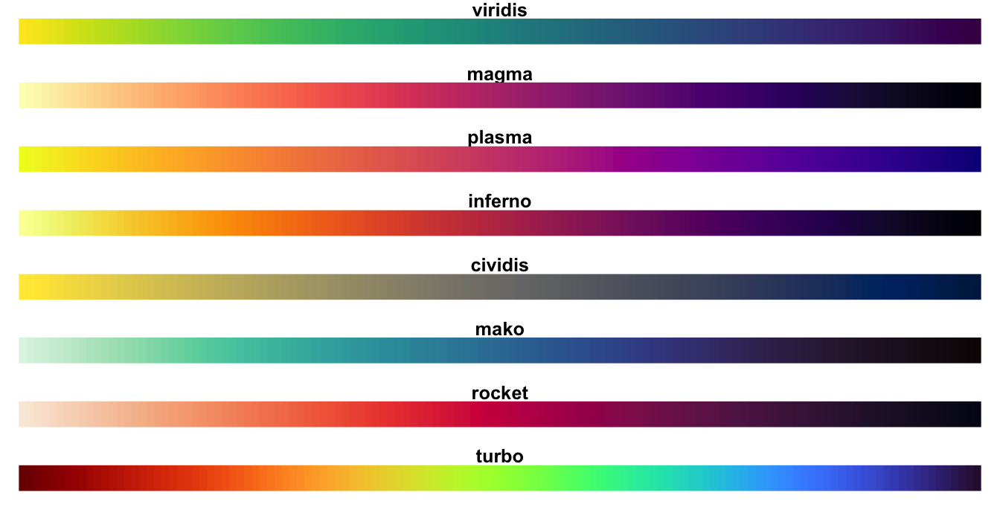
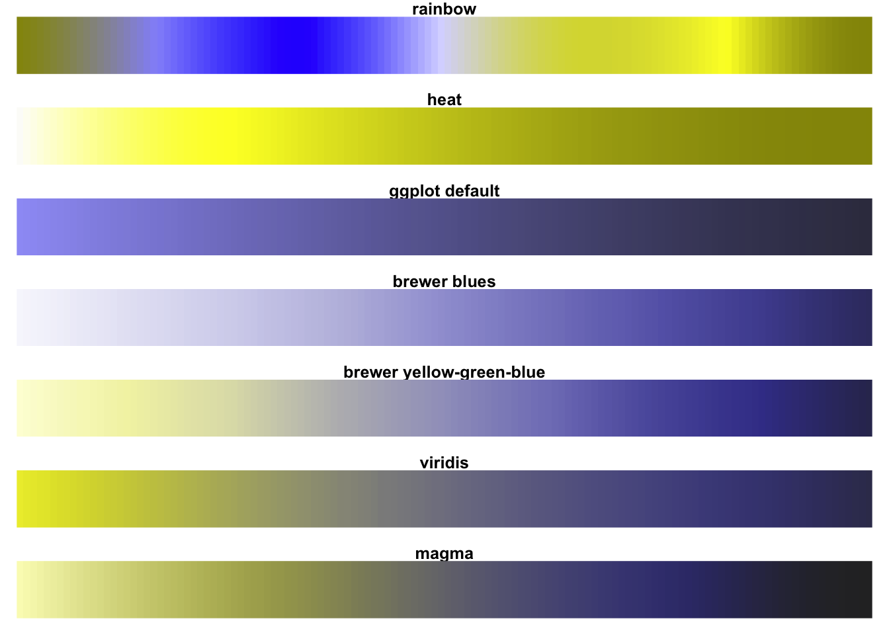
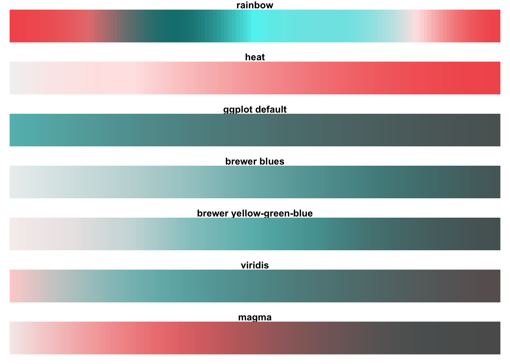
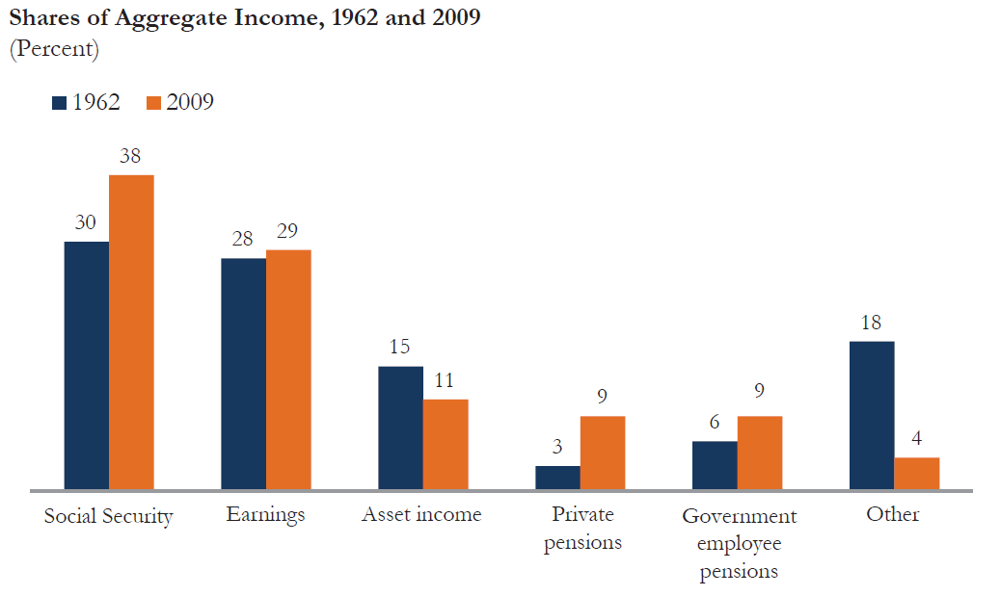
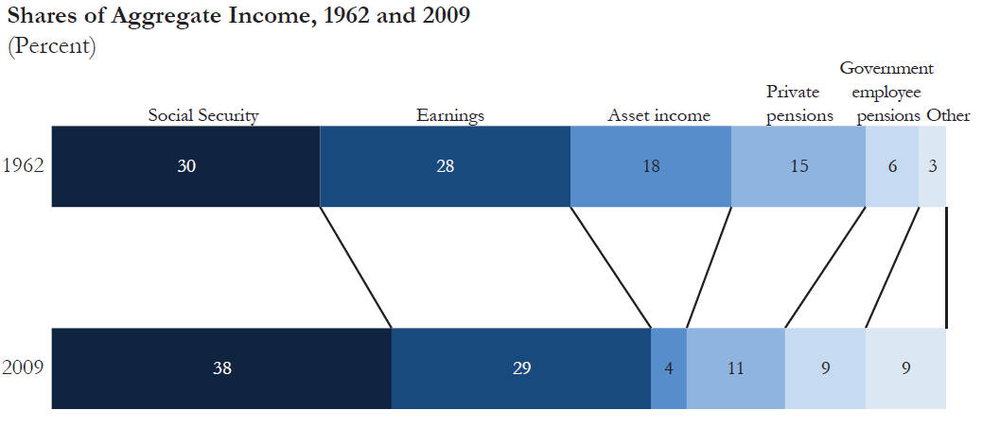
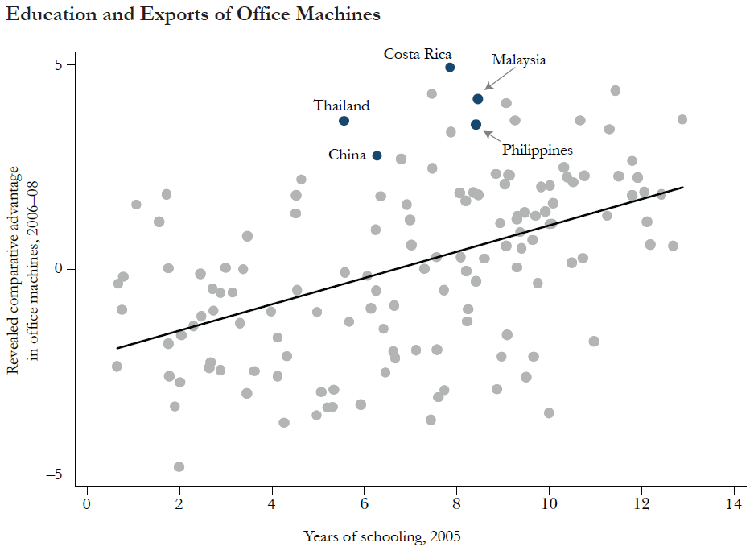
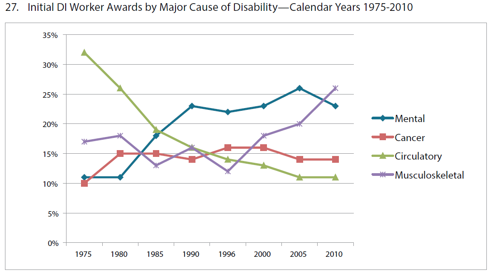

name: toc

```{css, echo=FALSE}
# CSS for including pauses in printed PDF output (see bottom of lecture)
@media print {
  .has-continuation {
    display: block !important;
  }
}
.remark-code-line {
  font-size: 95%;
}
.small {
  font-size: 75%;
}
.medsmall {
  font-size: 90%;
}
.scroll-output-full {
  height: 90%;
  overflow-y: scroll;
}
.scroll-output-75 {
  height: 75%;
  overflow-y: scroll;
}
```

```{r setup, include=FALSE}
options(htmltools.dir.version = FALSE)
library(knitr)
knitr::opts_chunk$set(
	fig.align = "center",
	out.width="80%",
	fig.height=4,
	cache = TRUE,
	dpi = 300,
  warning = F,
  message = F
)
```

# Table of contents

1. [Basics of ggplot2](#ggplot2)

1. [Plotting examples](#examples)

1. [Colors and themes](#colors)

1. [Principles of data visualization](#principles)

1. [Case studies](#cases)


---
class: inverse, middle
name: ggplot2

# Basics of ggplot2

---

# Syntax of ggplot2

"gg" = Grammar of Graphics.

Three components:
* Data
* Geometry
* Aesthetic mapping (from data to visual components)

Load the tidyverse if necessary, and this data on gun murders in the US in 2010:

```{r}
library(tidyverse)
if (!require("dslabs")) install.packages("dslabs")
library(dslabs)
data(murders)
```

---

# Syntax of ggplot2

Layer up components of plots with `+`:

```{r}
ggplot(murders)
```

---

# Syntax of ggplot2

Layer up components of plots with `+`:

```{r}
ggplot(murders) +
  geom_point(aes(x = population/10^6, y = total))
```

---

# Syntax of ggplot2

The aesthetic mapping can be **global** (in `ggplot()`, applying to all layers) or **local** (in a `geom_*` function, applying to one layer).

```{r}
ggplot(murders, aes(x = population/10^6, y = total)) +
  geom_point()
```

---

# Syntax of ggplot2

The aesthetic mapping can be **global** (in `ggplot()`, applying to all layers) or **local** (in a `geom_*` function, applying to one layer).

```{r}
ggplot(murders, aes(x = population/10^6, y = total)) +
  geom_point() +
  geom_text(aes(label = abb), nudge_x = 1)
```

---

# Labels, titles, scales

Put both axes on log-10 scales and add labels and a title:
.small[
```{r, fig.height=3.5}
ggplot(murders, aes(x = population/10^6, y = total, label = abb)) +
  geom_point(size = 2) +  
  geom_text(nudge_x = 0.05) + 
  scale_x_log10() +
  scale_y_log10() +
  xlab("Populations in millions (log scale)") + 
  ylab("Total number of murders (log scale)") +
  ggtitle("US Gun Murders in 2010")
```
]

---

# Intermediate graph objects

If we assign to an object everything except the points layer...
.small[
```{r, fig.height=3.5}
p = murders |> 
  ggplot(aes(x = population/10^6, y = total, label = abb)) +
    geom_text(nudge_x = 0.05) + 
    scale_x_log10() +
    scale_y_log10() +
    xlab("Populations in millions (log scale)") + 
    ylab("Total number of murders (log scale)") +
    ggtitle("US Gun Murders in 2010")
p
```
]

---

# Intermediate graph objects

...then we can easily build up new variations:

```{r}
p + geom_point(size = 3, color = "blue")
```

---

# Intermediate graph objects

...then we can easily build up new variations:

```{r}
p + geom_point(aes(color = region), size = 3)
```

---

# Exporting graphs

You can save your `ggplot2`-based figures using `ggsave()`.

**Option 1**: By default, `ggsave()` saves the last plot printed to the screen.

```{R, ex-ggsave-1, eval = F}
# Create a simple scatter plot
ggplot(data = fun_df, aes(x = x, y = y)) +
geom_point()

# Save our simple scatter plot
ggsave(filename = "simple_scatter.pdf")
```

- This example creates a PDF. Change to `".png"` for PNG, etc.
- Optional arguments: `path`, `width`, `height`, `dpi`.

---
# Exporting graphs

**Option 2:** You can assign your `ggplot()` objects to memory:
```{R, ex-gg-assign, eval = F}
# Create a simple scatter plot named 'gg_points'
gg_points = ggplot(data = fun_df, aes(x = x, y = y)) +
geom_point()
```

And then save this figure with the name `gg_points`:
```{R, ex-ggsave-2, eval = F}
# Save our simple scatter plot name 'ggsave'
ggsave(
  filename = "simple_scatter.pdf",
  plot = gg_points
)
```

---

# Exporting graphs

In what format should you save your graphics?

**Vector** graphics are composed of formulas or paths.
- "Draw a straight line from (0, 0) to (13, 4)."
- Infinitely zoom-able. Preserves all underlying information.
- May be slow to load when complex.
- `.pdf` or `.svg`.

**Raster** graphics are composed of pixels (a grid of squares with color information).
- Only an approximation to the underlying shapes or points.
- Work better with Microsoft Office and HTML.
- The original format of photographs.
- Usually best: `.png`. Also `.jpeg`, `.gif`.


---
class: inverse, middle
name: examples

# Plotting examples

---

# Start with a scatterplot

Let's use a fuller version of the `gapminder` dataset from the `dslabs` package:

```{r load libraries, message=FALSE, echo=TRUE}
data(gapminder)
gapminder
```

---

# Start with a scatterplot

How have fertility rates and life expectancies co-evolved over time?

First, plotting the data from 1962:

```{r fertility-versus-life-expectancy-1962, warning=FALSE}
filter(gapminder, year == 1962) |>
  ggplot(aes(fertility, life_expectancy)) +
    geom_point()
```

---

# Start with a scatterplot

How have fertility rates and life expectancies co-evolved over time?

First, plotting the data from 1962:

```{r fertility-versus-life-expectancy-1962-with-color}
filter(gapminder, year == 1962) |>
  ggplot(aes(fertility, life_expectancy, color = continent)) +
    geom_point() 
```

---

# Faceting

Stratify (by continent, and compare 1962 to 2012) with `facet_grid`:
.small[
```{r fertility-versus-life-expectancy-facet, warning=FALSE, fig.height=4.5}
filter(gapminder, year %in% c(1962, 2012)) |>
  ggplot(aes(fertility, life_expectancy, col = continent)) +
    geom_point() +
    facet_grid(continent ~ year)  # "row ~ column"
```
]

---

# Faceting

Show Europe vs. Asia for 5 different years:
.small[
```{r fertility-versus-life-expectancy-five-years-tall, out.width="90%", fig.height=3.5}
years = c(1962, 1980, 1990, 2000, 2012)
continents = c("Europe", "Asia")
gapminder |> 
  filter(year %in% years & continent %in% continents) |>
  ggplot( aes(fertility, life_expectancy, col = continent)) +
    geom_point() +
    facet_grid(. ~ year)
```
]

---

# Faceting

Too narrow? Wrap rows with `facet_wrap`:
.small[
```{r fertility-versus-life-expectancy-five-years, out.width="90%", fig.height=3.5}
years = c(1962, 1980, 1990, 2000, 2012)
continents = c("Europe", "Asia")
gapminder |> 
  filter(year %in% years & continent %in% continents) |>
  ggplot( aes(fertility, life_expectancy, col = continent)) +
    geom_point() +
    facet_wrap(~year) 
```
]

---

# Faceting

An important thing `facet` gives us is common axis scales. Otherwise graphs look like this:
.small[
```{r facet-without-fixed-scales, warning=FALSE, out.width="90%", fig.height=3.5}
years = c(1962, 1980, 1990, 2000, 2012)
continents = c("Europe", "Asia")
gapminder |> 
  filter(year %in% years & continent %in% continents) |>
  ggplot( aes(fertility, life_expectancy, col = continent)) +
    geom_point() +
    facet_wrap(~year, scales = "free")
```
]

---

# Time series plots

Points connected with a line:

```{r fertility-time-series-plot-curve, warning=FALSE}
gapminder |> 
  filter(country == "United States") |> 
  ggplot(aes(year, fertility)) +
    geom_point() +
    geom_line()
```

---

# Time series plots

Show two countries by color:

```{r time-series-two-curves, warning=FALSE, message=FALSE}
countries = c("South Korea", "Germany")

gapminder |> filter(country %in% countries & !is.na(fertility)) |> 
  ggplot(aes(year, life_expectancy, color = country)) +
    geom_line()
```

---

# Time series plots

Labels are generally more effective than legends. Add text at specific points:
.small[
```{r labels-better-than-legends}
labels = data.frame(country = countries, x = c(1975, 1965), y = c(60, 72))

gapminder |> 
  filter(country %in% countries) |> 
  ggplot(aes(year, life_expectancy, col = country)) +
    geom_line() +
    geom_text(data = labels, aes(x, y, label = country), size = 5) +
    theme(legend.position = "none")
```
]

---

# Cleveland dot plots

**Cleveland dot plots** are uncluttered and can be more effective than bar charts.
- Especially when the x-intercept doesn't mean much.
- Or when plotting multiple values per category.

.small[
```{r, fig.height=3}
gapminder |> mutate(GDP_percapita = gdp/population) |>
  filter(year == 1970 & !is.na(GDP_percapita) & continent=="Asia") |>
  mutate() |>
  ggplot(aes(GDP_percapita, country)) +
    geom_point(size=2) +
    scale_x_log10()
```
]

---

# Cleveland dot plots

**Cleveland dot plots** are uncluttered and can be more effective than bar charts.
- Especially when the x-intercept doesn't mean much.
- Or when plotting multiple values per category.

.small[
```{r, fig.height=3}
gapminder |> mutate(GDP_percapita = gdp/population) |>
  filter(year == 1970 & !is.na(GDP_percapita) & continent=="Asia") |>
  mutate(country = reorder(country, GDP_percapita)) |>
  ggplot(aes(GDP_percapita, country)) +
    geom_point(size=2) +
    scale_x_log10()
```
]

---

# Cleveland dot plots

**Cleveland dot plots** are uncluttered and can be more effective than bar charts.
- Especially when the x-intercept doesn't mean much.
- Or when plotting multiple values per category.

.small[
```{r, fig.height=3}
gapminder |> mutate(GDP_percapita = gdp/population) |>
  filter(year %in% c(1970, 1980) & !is.na(GDP_percapita) & continent=="Asia") |>
  mutate(country = reorder(country, GDP_percapita)) |>
  ggplot(aes(GDP_percapita, country)) +
    geom_line(aes(group = country)) +
    geom_point(size=2, aes(color = factor(year))) +
    scale_x_log10()
```
]

---

# Ridge plots

Using `ggridges`: (*Why not box / box-and-whisker plots?*)

.small[
```{r ridge-plot, message=FALSE}
library(ggridges)
gapminder |> mutate(GDP_percapita = gdp/population) |>
  filter(year == 1970 & !is.na(GDP_percapita)) |>
  ggplot(aes(GDP_percapita, y = continent, fill = continent)) + 
    geom_density_ridges() +
    scale_x_log10()
```
]

---

# Animations

With package `gganimate`:

```{R cache=TRUE, dev="png", ex-gganimate, include=FALSE}
# The package for animating ggplot2
library(gganimate)
library(gapminder)
# As before
gg = ggplot(
  data = gapminder::gapminder |> filter(continent != "Oceania"),
  aes(gdpPercap, lifeExp, size = pop, color = country)
) +
  geom_point(alpha = 0.7, show.legend = FALSE) +
  scale_colour_manual(values = country_colors) +
  scale_size(range = c(2, 12)) +
  scale_x_log10("GDP per capita", label = scales::comma) +
  facet_wrap(~continent) +
  theme_light(base_size = 16) +
  theme(panel.border = element_rect(color = "grey90", fill = NA)) +
  # Here come the gganimate-specific bits
  labs(title = "Year: {frame_time}") +
  ylab("Life Expectancy") +
  transition_time(year) +
  ease_aes("linear")
# Save the animation
anim_save(
  animation = gg,
  filename = "img/ex_gganimate.gif",
  width = 10.5,
  height = 7,
  units = "in",
  res = 150,
  nframes = 56
)
```

```{r, echo=F, out.width="85%"}
include_graphics("img/ex_gganimate.gif")
```

.small[Image and code from ["Plotting in R"](https://raw.githack.com/edrubin/EC525S19/master/NotesLab/05RPlot/05RPlot.html) by Edward Rubin, used with permission, and excluded from the overall CC license.]

---

# I need help choosing/coding!

Try [From Data to Viz](https://www.data-to-viz.com/).

- Recommends graph types tailored to the type of data you have

- Links to inspirational examples and sample code

- Warns about tricky aspects to pay attention to.


---
class: inverse, middle
name: colors

# Color schemes and themes

---

# Color schemes

Choose a **sequential** color scheme when your values are ordered in only one direction.
- Low to high; values are all positive; zero is defined arbitrarily.

```{r, out.width="90%", fig.height=4.5}
library(RColorBrewer)
display.brewer.all(type="seq")
```

---

# Color schemes

Choose a **diverging** color scheme when your values are ordered in two directions relative to a center.
- Positive vs. negative; vote shares relative to 50%.

```{r, out.width="100%"}
display.brewer.all(type="div")
```

---

# Color schemes

Choose a **qualitative** color scheme when your values have no ordering.
- Only need to distinguish among categories.

```{r, out.width="100%"}
display.brewer.all(type="qual")
```

---

# Use established color schemes

Use color schemes created by professional visual designers. They have thought about it harder than you!

- `RColorBrewer` is based on the research of cartographer Cynthia Brewer. Her [ColorBrewer](https://colorbrewer2.org/) website lets you choose a color scheme by value ordering and whether you need it to be colorblind safe, printer friendly, or photocopy safe.

- `viridis` schemes are designed to span a large **perceptual range** while remaining **perceptually uniform**, robust to colorblindness, and pretty. (The next few slides show diagrams from the the package's [vignette](https://cran.r-project.org/web/packages/viridis/vignettes/intro-to-viridis.html).)

---

# Use established color schemes

Palettes available in `viridis`:

```{r, echo=F, out.width="100%"}

```


---

# Comparing palettes

Compare `rainbow` and `heat` from base R, the default `ggplot2` palette, and palettes from `RColorBrewer` and `viridis`:

```{r, out.width="80%", echo=F}
include_graphics("img/v-comparison.png")
```

---

# Consider colorblindness

Green-Blind (Deuteranopia):

```{r, out.width="80%", echo=F}

```


---

# Consider colorblindness

Red-Blind (Protanopia):

```{r, out.width="80%", echo=F}
include_graphics("img/v-compare-redblind.png")
```


---

# Consider colorblindness

Blue-Blind (Tritanopia):

```{r, out.width="80%", echo=F}

```

---

# Consider printer-friendliness

Grayscale:

```{r, out.width="80%", echo=F}
include_graphics("img/v-compare-grayscale.png")
```


---

# Themes

**Themes** set defaults for all the formatting details. Default in `ggplot` is `theme_gray`:

```{r}
filter(gapminder, year == 1962) |>
  ggplot(aes(fertility, life_expectancy, color = continent)) +
    geom_point() +
    theme_gray()
```

---

# Themes

Try it with `theme_bw()`:

```{r}
filter(gapminder, year == 1962) |>
  ggplot(aes(fertility, life_expectancy, color = continent)) +
    geom_point() +
    theme_bw()
```

---

# Themes

Try it with `theme_minimal()`:

```{r}
filter(gapminder, year == 1962) |>
  ggplot(aes(fertility, life_expectancy, color = continent)) +
    geom_point() +
    theme_minimal()
```

---

# Themes

Try it with `theme_classic()`:

```{r}
filter(gapminder, year == 1962) |>
  ggplot(aes(fertility, life_expectancy, color = continent)) +
    geom_point() +
    theme_classic()
```

---

# Themes

Try it with `theme_void()`:

```{r}
filter(gapminder, year == 1962) |>
  ggplot(aes(fertility, life_expectancy, color = continent)) +
    geom_point() +
    theme_void()
```

---

# Themes

- More themes available with `ggthemes`, or tons of other packages.


---
class: inverse, middle
name: principles

# Principles of data visualization

---

# Choose visual cues deliberately

Humans' ability to perceive differences in magnitude descends in this order:

- Position
- Length
- Angle
- Direction
- Shape
- Area
- Volume
- Shade
- Color

Try to use cues higher on this list to convey your main point.

</br>

Source: [Modern Data Science with R, chapter 2](https://mdsr-book.github.io/mdsr2e/ch-vizI.html).

---

# Choose visual cues deliberately

Humans are bad at quantifying angles, areas, and shades of color.

```{r, out.width="75%", echo=F}
include_graphics("img/two-barplots-1.png")
```

---

# Choose visual cues deliberately

If you must use a pie chart, at least label the segments and values.

```{r, out.width="100%", echo=F}
include_graphics("img/case4-a.PNG")
```

.small[Image is from ["An Economist's Guide to Visualizing Data"](https://www.aeaweb.org/articles?id=10.1257/jep.28.1.209) by Jonathan Schwabish and excluded from the overall CC license.]

---

# Choose visual cues deliberately

Alternative to pie charts (1):

```{r, out.width="95%", echo=F}

```

.small[Image is from ["An Economist's Guide to Visualizing Data"](https://www.aeaweb.org/articles?id=10.1257/jep.28.1.209) by Jonathan Schwabish and excluded from the overall CC license.]

---

# Choose visual cues deliberately

Alternative to pie charts (2):

```{r, out.width="100%", echo=F}

```

.small[Image is from ["An Economist's Guide to Visualizing Data"](https://www.aeaweb.org/articles?id=10.1257/jep.28.1.209) by Jonathan Schwabish and excluded from the overall CC license.]

---

# Choose visual cues deliberately

Alternative to pie charts (3):

```{r, out.width="100%", echo=F}
include_graphics("img/case4-d.PNG")
```

.small[Image is from ["An Economist's Guide to Visualizing Data"](https://www.aeaweb.org/articles?id=10.1257/jep.28.1.209) by Jonathan Schwabish and excluded from the overall CC license.]

---

# Know when to include zero

Bar plots imply length (the visual cue) is proportional to quantities.

```{r, out.width="80%", echo=F}
include_graphics("img/border-1.jpg")
```

---

# Know when to include zero

Bar plots imply length (the visual cue) is proportional to quantities.

```{r, out.width="80%", echo=F}
include_graphics("img/border-2.png")
```

---

# Know when to include zero

Dot/scatter plots do not -- because they use position, not length.

```{r, out.width="100%", echo=F}
include_graphics("img/points-plot-not-from-zero-1.png")
```

---

# Avoid three-dimensional visualizations

Instead consider multiple layers or series, facets, or animation.

--

Especially avoid false third dimensions -- they add no information, distract, and obscure real information.

```{r, out.width="75%", echo=F}
include_graphics("img/pseudo-3d-1.png")
```

---

# Avoid three-dimensional visualizations

Instead consider multiple layers or series, facets, or animation.

Especially avoid false third dimensions -- they add no information, distract, and obscure real information.

```{r, out.width="75%", echo=F}
include_graphics("img/pseudo-3d-2.png")
```

---

# Avoid too many significant digits

They add no information, distract, and imply false precision.

.small[

.pull-left[
```{r, echo=FALSE}
data(us_contagious_diseases)
tmp = options()$digits
options(digits=7)
dat = us_contagious_diseases |>
  filter(year %in% seq(1940, 1980, 10) &  state == "California" &
          disease %in% c("Measles", "Pertussis", "Polio")) |>
  mutate(rate = count / population * 10000) |> 
  mutate(state = reorder(state, rate)) |> 
  select(state, year, disease, rate) |>
  spread(disease, rate)
if(knitr::is_html_output()){
  knitr::kable(dat, "html") |>
    kableExtra::kable_styling(bootstrap_options = "striped", full_width = FALSE)
} else{
  knitr::kable(dat, "latex", booktabs = TRUE) |>
    kableExtra::kable_styling(font_size = 8)
}
options(digits=tmp)
```
]

.pull-right[
```{r, echo = FALSE}
dat = dat |> 
  mutate_at(c("Measles", "Pertussis", "Polio"), ~round(., digits=1))
if(knitr::is_html_output()){
  knitr::kable(dat, "html") |>
    kableExtra::kable_styling(bootstrap_options = "striped", full_width = FALSE)
} else{
  knitr::kable(dat, "latex", booktabs = TRUE) |>
    kableExtra::kable_styling(font_size=8)
}
```
]

]

</br>

</br>

Useful ways to change the number of significant digits or to round numbers are `signif` and `round`. You can define the number of significant digits globally by setting options like this: `options(digits = 3)`. 

---

# Know your audience

Log-transformed data may be great for experts, but can mislead the general public.

```{r, out.width="95%", echo=F}
include_graphics("img/covid-log.png")
```
.small[Source: [New York Times, March 20, 2020](https://www.nytimes.com/2020/03/20/health/coronavirus-data-logarithm-chart.html).]

---

# Choose one message and stick with it

Ask yourself: What is the **central message** you are trying to communicate?

Decide, then build your plot around that message.
- Make that message as easy to see as you can.
- **Remove the clutter** -- get rid of any features of the visualization that do not contribute to the central message.

</br>

**Rich** visualizations can still be great, as long as the main message jumps out.
- Showing the individual data points can illuminate your message in some cases, and obscure it in others.

---
class: clear, middle, center

```{r, out.width="85%", echo=F}
include_graphics("img/wsj-vaccines-example-1.png")
```

.small[Source: [Wall Street Journal, February 11, 2015](http://graphics.wsj.com/infectious-diseases-and-vaccines/).]


---
class: inverse, middle
name: cases

# Case studies

Images from Jonathan Schwabish (2014), ["An Economist's Guide to Visualizing Data,"](https://www.aeaweb.org/articles?id=10.1257/jep.28.1.209) *Journal of Economic Perspectives*. This section is excluded from this resource's overall CC license.

---

# Case 1: How can it be improved?

```{r, out.width="92%", echo=F}
include_graphics("img/case1-a.PNG")
```


---

# Case 1: Improved

```{r, out.width="92%", echo=F}
include_graphics("img/case1-b.PNG")
```

---

# Case 2: How can it be improved?

```{r, out.width="92%", echo=F}
include_graphics("img/case2-a.PNG")
```

---

# Case 2: Improved

```{r, out.width="92%", echo=F}

```

---

# Case 3: How can it be improved?

```{r, out.width="92%", echo=F}

```

---

# Case 3: Improved

```{r, out.width="92%", echo=F}
include_graphics("img/case3-b.PNG")
```

---

# Summary

1. [Basics of ggplot2](#ggplot2)

1. [Plotting examples](#examples)

1. [Colors and themes](#colors)

1. [Principles of data visualization](#principles)

1. [Case studies](#cases)

