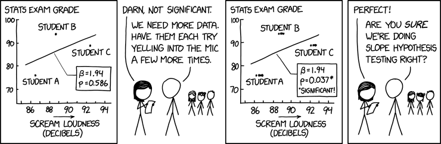

```{css, echo=FALSE}
# CSS for including pauses in printed PDF output (see bottom of lecture)
@media print {
  .has-continuation {
    display: block !important;
  }
}
.remark-code-line {
  font-size: 95%;
}
.small {
  font-size: 75%;
}
.scroll-output-full {
  height: 90%;
  overflow-y: scroll;
}
.scroll-output-75 {
  height: 75%;
  overflow-y: scroll;
}
```

```{r setup, include=FALSE}
options(htmltools.dir.version = FALSE)
library(knitr)
knitr::opts_chunk$set(
	fig.align = "center",
	cache = TRUE,
	dpi = 300,
  warning = F,
  message = F
)
```

# Table of contents

1. [Basic regression in R](#basics)

1. [Review: Interpreting coefficients](#interpret)

1. [Indicator and interaction terms](#indicators)

1. [Econometrics packages in R](#functions)

1. [Modeling nonlinear relationships](#nonlinear)

1. [Preview: Model validation](#validation)


---
class: inverse, middle
name: basics

# Regression in R

---

# Prep work

Load the packages we'll be using:

```{r libs}
if (!require("pacman")) install.packages("pacman")
pacman::p_load(tidyverse, estimatr, broom, summarytools, fixest, binsreg)
```

We'll mostly be working with the `starwars` data frame that comes with `dplyr`.
```{r starwars}
head(starwars)
```

---

# Basic regression

Base R's command for running regression models is `lm()` ("linear models").

```r
lm(y ~ x1 + x2 + x3, data = df)
```

It estimates this regression:

$$y_i = \beta_0 + \beta_1 x_{1i} + \beta_2 x_{2i} + \beta_3 x_{3i} + u_i$$

Using the variables (columns) `y` and `x` from the object `df`.

---

# Basic regression

Let's run a simple bivariate regression of mass on height using our dataset of Star Wars characters.

```{r ols1}
ols1 = lm(mass ~ height, data = starwars)
ols1
```

Most valuable information is buried within this object's internal list structure. Try `View(ols1)`.

---

# Basic regression

To summarise the key pieces of information, we can use the generic summary() function. This will look pretty similar to the default regression output from Stata.

```{r ols1_summ}
summary(ols1)
```

---

# Basic regression

To just show the coefficients:

```{r ols1_coefs}
summary(ols1)$coefficients
```

---

# Get tidy regression coefficients

Note advantage over Stata: the regression is an object, not an action.
- Results are stored for later use -- they don't just disappear.

In practice you'll often want to convert your regression output to a tidy data frame (aka tibble). You can do this using `tidy()` from the `broom` package.

```{r ols1_tidy}
tidy(ols1, conf.int = TRUE)
```

---

# Subsetting data for a regression

What data analysis mistake have we made already?

--

**We didn't plot our data.** 😱

```{r jabba, out.width="80%", fig.height=4}
ggplot(starwars, aes(x=height, y=mass)) +
  geom_point()
```

---

# Subsetting data for a regression

If we think Jabba is not part of the same data generating process we want to study, we can filter him out.

```{r ols2a}
no_jabba = starwars |> filter(!str_detect(name, "Jabba"))
ols2 = lm(mass ~ height, no_jabba)
summary(ols2) |> tidy()
```


---
class: inverse, middle
name: interpret

# Review: Interpreting coefficients


---

# Interpreting regression coefficients

$$y_i = \alpha + \beta x_{i} + u_i$$

- $\beta$: The "effect" of $x$ on $y$.
  - How much $y$ changes in response to a one-unit change in $x$.
  - The average derivative: $dy/dx$.
  - Not necessarily causal! Only if you can assume away selection bias.

* $\alpha$: The y-intercept.
  - The average value of $y$ when $x = 0$.

```{r}
lm(mass ~ height, no_jabba) |> tidy()
```

Put into a complete sentence with units:

--
- "For every **1 cm** increase in height, average mass increases by **0.6 kg.**"

---

# Interpreting log-transformed variables

$$\log(y_i) = \alpha + \beta x_{i} + u_i$$

```{r}
lm(log(mass) ~ height, no_jabba) |> tidy()
```

Still true: **"A one-unit change in $x$ is associated with a $\beta$-unit change in $y$."**
- Here: "A **1 cm** change in height is associated with a **0.01 log unit** change in mass."

--

But log units have a convenient **proportional change** or **percentage change** interpretation:
- "A **1-cm** change in height is associated with a **0.01 times** change in mass."
- "A **1-cm** change in height is associated with a **1-percent** change in mass."

---

# Interpreting log-transformed variables

**Why?** Here's the algebra:

Original values $x_0$ and $y_0$. Percentage change in $y$ is $\% \Delta y = \Delta y / y_0$.

Model:
$$\ln(y_0) = \alpha + \beta x_0$$
$$\ln(y_0 + \Delta y) = \alpha + \beta (x_0 + 1)$$

Solve for $\% \Delta y$:
$$\ln(y_0 + \Delta y) = \ln(y_0) + \beta$$
$$\ln(\frac{y_0 + \Delta y}{y_0}) = \beta$$
$$\ln(1 + \% \Delta y) = \beta$$

Using the approximation $\ln(a+1) \approx a$ for small $a$:
$$\beta \approx \% \Delta y.$$

---

# Interpreting log-transformed variables

$$y_i = \alpha + \beta \log(x_{i}) + u_i$$

```{r}
lm(mass ~ log(height), no_jabba) |> tidy()
```

Still true: **"A one-unit change in $x$ is associated with a $\beta$-unit change in $y$."**

--
- Here: "A **1 log unit** change in height is associated with an **82-kg** change in mass."

--
- "A **100%** change in height is associated with a **82-kg** change in mass."
- "A **10%** change in height is associated with an **8.2-kg** change in mass."


---

# Interpreting log-transformed variables

$$\log(y_i) = \alpha + \beta \log(x_{i}) + u_i$$

```{r}
lm(log(mass) ~ log(height), no_jabba) |> tidy()
```

Still true: **"A one-unit change in $x$ is associated with a $\beta$-unit change in $y$."**

--
- Here: "A **1 log unit** change in height is associated with a **1.6 log unit** change in mass."

--
- "A **100%** change in height is associated with a **1.6 times** change in mass."
- "A **100%** change in height is associated with a **160 percent** change in mass."

--
- "A **10%** change in height is associated with a **16 percent** change in mass."
- "A **1%** change in height is associated with a **1.6 percent** change in mass."


---
class: inverse, middle
name: indicators

# Indicator and interaction terms

---

# Indicator variables

For the next example, let's use only the human characters.

```{r humans}
humans = filter(starwars, species=="Human")

freq(humans$gender)
```

---

# Indicator variables

```{r}
humans = humans |> mutate(masculine = as.integer(gender == "masculine"))
lm(mass ~ masculine, data = humans) |> tidy()
```

How do we interpret the `masculine` coefficient?

--
- The variable is coded as $0$ for `feminine` and $1$ for `masculine`.
- So the intercept gives the average mass of `feminine` characters: $\alpha = 56$ kg.

--
- Relative to that, the average effect of being `masculine` on mass is $30.6$ kg.
- So the average mass of `masculine` characters is $56 + 31 = 87$ kg.


---

# Indicator variables

If we don't want to have to add up terms we can estimate the mean for each group separately! (Just omit the intercept.)

```{r}
humans = humans |> mutate(feminine = 1 - masculine)
lm(mass ~ feminine + masculine + 0, data = humans) |> tidy()
group_by(humans, gender) |> summarize(mean(mass, na.rm=T))
```

---

# Indicator variables

We actually didn't need to specifically create new binary variables. R will automatically interpret any factor (or string!) variables as indicators:

```{r ols_dv2}
lm(mass ~ gender, data = humans) |> tidy()
```

---

# Interaction terms

To find the effect of height separately for each gender, we can estimate this regression:
$$Mass_i = \beta_0 + \beta_1 Masc_i + \beta_2 Height_i + \beta_3 Masc_i \times Height_i + u_i$$

Interpretation:
- $\beta_0$ is the $y$-intercept of height for feminine characters.
- $\beta_1$ is the change to the $y$-intercept for masculine characters ( $Masc_i=1$ ).
- $\beta_2$ is the effect of height for feminine characters.
- $\beta_3$ is the *additional* effect of height for masculine characters.
- $\beta_2 + \beta_3$ is the effect of height for masculine characters.


---

# Interaction terms

To find the effect of height separately for each gender, we can estimate this regression:
$$Mass_i = \beta_0 + \beta_1 Masc_i + \beta_2 Height_i + \beta_3 Masc_i \times Height_i + u_i$$

Two equivalent syntaxes:
```{r, eval=F}
lm(mass ~ gender * height, data = humans)
```
```{r, eval=F}
lm(mass ~ height + gender + height:gender, data = humans)
```

Using `*` is a good default. In most cases, you need to include all "parent" terms in order to interpret the interaction correctly.

---

# Interaction terms

To find the effect of height separately for each gender, we can estimate this regression:
$$Mass_i = \beta_0 + \beta_1 Masc_i + \beta_2 Height_i + \beta_3 Masc_i \times Height_i + u_i$$

```{r ols_ie2}
lm(mass ~ gender * height, data = humans) |> tidy()
```

**Interpret each height coefficient in a sentence.**

--
- "For each 1-cm increase in height, mass increases for feminine characters by $0.73$ kg."

--
- "For each 1-cm increase in height, mass increases by $0.16$ kg *more* (or *faster*) for masculine characters than it does for feminine characters."

--
- "For each 1-cm increase in height, mass increases for masculine characters by $0.73 + 0.16 = 0.90$ kg."

---

# Transformations

R will do any other transformations you want inline, without having to `mutate()`.

- Arithmetic transformations: `x^2`, `I(x/3)`, `I((x - mean(x))/sd(x))`

- Log/exponential transformations: `log(x)`, `exp(x)`

- Indicators: `I(x < 100)`, `I(x == "Montana")`

---

# Challenge

Estimate this regression in the original `starwars` dataset:

$$\begin{eqnarray}
Mass_{i} &=& \beta_0 + \beta_1 Height_i + \beta_2 Height^2_i + \beta_3 \log(Age_i) + \\
& & \beta_4 Height_i \times \log(Age_i) + \beta_5 1(Jabba_i) + u_i
\end{eqnarray}$$

(Remember the variable `birth_year` encodes age, for some reason.)


<!--  !!!  Don't look at the next slide until you try coding it yourself  !!!   -->


--

```{r echo=FALSE}
reg_challenge = lm(
  mass ~ height * log(birth_year) + I(height^2) + I(str_detect(name, "Jabba")),
  data = starwars
  )
summary(reg_challenge) |>
  tidy() |>
  select(-term)
```

---

# Challenge

Estimate this regression in the original `starwars` dataset:

$$\begin{eqnarray}
Mass_{i} &=& \beta_0 + \beta_1 Height_i + \beta_2 Height^2_i + \beta_3 \log(Age_i) + \\
& & \beta_4 Height_i \times \log(Age_i) + \beta_5 1(Jabba_i) + u_i
\end{eqnarray}$$

```{r}
reg_challenge = lm(
  mass ~ height * log(birth_year) + I(height^2) + I(str_detect(name, "Jabba")),
  data = starwars
  )
tidy(summary(reg_challenge))
```

---

# More challenge

Try these on your own time:

1. Run the same regression, but instead of creating an indicator just for Jabba, filter him out beforehand. Do you get the same results?

2. There was a lot of missing data for `birth_year` (i.e., age). How many observations did `lm()` actually use? (Hint: Explore the resulting object some more.)

---

# Even more challenge

Let's not throw out all those observations just because we can't control for age. Use the flag approach to deal with this variable:

1. Create a new binary indicator variable that =1 if `birth_year` is missing and =0 otherwise.

1. Create a new variable that equals `log(birth_year)` except a specific value is filled in for all rows with missing values (choose a value outside the existing range of `log(birth_year)`).

1. Verify that `mass ~ log(birth_year)` and `mass ~ new_variable + flag_variable` yield the same coefficient on the continuous variable.

1. Re-run the same regression on the previous slide, using this flag approach. (Make sure to treat the flag variable *exactly* the same way as the continuous variable -- if you were interacting both with X before, interact both with X now.)
  

---
class: inverse, middle
name: functions

# Econometrics packages in R

---

# Robust standard errors

`lm()` uses classical/homoskedastic standard errors, which you basically should **never** use.

You can obtain heteroskedasticity-consistent "robust" standard errors using `estimatr::lm_robust()`.

```{r ols1_robust}
ols1_robust = lm_robust(mass ~ height, data = starwars)
ols1_robust
```


---

# Clustered standard errors

If you haven't learned about clustering yet...

You want to **cluster** your standard errors whenever your observations are correlated within unit/group/geography (i.e., not fully independent draws from a population).



Clustering is for cross-sectional or panel data. (Time series data calls for other solutions.)

---

# Clustered standard errors

To cluster by `homeworld`:

```{r ols1_robust_clustered, warning = FALSE}
lm_robust(mass ~ height, data = starwars, clusters = homeworld)
```

---

# Fixed effect regressions

Most "real" regressions you run in economics will involve fixed effects of some kind (i.e., many group- or unit-specific indicators).

`fixest::feols()` **should be your new best friend.**
- It can handle large numbers of fixed effects quickly and quietly.
- It has tons of options and is *orders of magnitude* faster than alternatives (`lfe` in R or `reghdfe` in Stata).
- It can also handle simpler regressions, so it deserves to be your default everyday regression function.

Syntax to include species FE:

$$Mass_{i} = \beta_0 + \beta_1 Height_{i} + \lambda_{species} + u_i$$

```{r ols_fe2, results = F}
ols_fe = feols(mass ~ height | species, data = starwars)
```

---

# Regression tables

Get **quick regression tables** with `fixest::etable()`:

```{r}
etable(ols_fe, ols_fe)
```

</br>

Try package `modelsummary` for publication-quality tables that you can output with formatting to LaTeX, Markdown, etc.

---

# Other models in R

Instrumental variables (IV) regressions:

- `fixest::feols()` (see, your new best friend!)
  - Syntax: `y ~ controls | fe | endogenous ~ instrument`.
- `estimatr::iv_robust()` 
- `ivreg::ivreg()`

Logit regression:

- `glm(formula, data, family = binomial(link = "logit"))`
- `feglm(formula, data, family = binomial(link = "logit"))`
- To get marginal effects, try package `mfx`.

"glm" stands for generalized linear models.


---
class: inverse, middle
name: nonlinear

# Modeling nonlinear relationships

---

# Some preliminaries

Load the London Airbnb data we used in the Exploratory Analysis lecture, and take a 10% random sample:
```{r}
set.seed(123)
london = read_csv("https://osf.io/ey5p7/download")
london_sample = london |> 
  mutate(ln_price = log(price)) |> 
  filter(!is.na(price)) |>
  slice_sample(prop = 0.05)
```
  
---

# Modeling nonlinear relationships

**How should we model the relationship between longitude and price?**

--

First, we need to check the CEF with a quick binscatter:
```{r, fig.height=4.3, out.width="80%", message=FALSE, warning=FALSE}
binsreg(y = london_sample$ln_price, x = london_sample$longitude)
```

---

# Modeling nonlinear relationships

So then... **what's wrong with running the following regression?**
```{r}
linear = feols(ln_price ~ longitude, data = london_sample)
tidy(linear)
```

--
The plot showed us that a linear specification of longitude is a bad fit.
* It still tells us an average derivative.
* But that's not an average that's very useful.

Instead, let's choose a **nonlinear specification** that get us closer to the true CEF.

--
1. Bin regression (step functions).
2. Polynomial regression.
3. Piecewise functions (splines).


---

# Bin regression (step functions)

Just like a binscatter. Use a regression to estimate means by quantile:
```{r}
binned = feols(ln_price ~ factor(ntile(longitude, 10)), data = london_sample)
tidy(binned)
```

**How do we interpret these coefficients?**

---

# Bin regression (step functions)

To visualize the estimated regression model, **generate fitted values** using `predict`:
```{r, fig.height=3.7, out.width="80%"}
binned_predict = predict(binned, data = london_sample, interval = "confidence")
binned_fitted = cbind(london_sample, binned_predict)
head(binned_predict)
```

Note this calculates a **confidence** interval, not a **prediction** interval.
- Confidence interval: Uncertainty about the true conditional mean.
- Prediction interval: Uncertainty about individual observations.

---

# Bin regression (step functions)

```{r, fig.height=4.6, out.width="80%"}
ggplot(binned_fitted, aes(x = longitude)) + theme_light() +
  geom_point(aes(y = ln_price), alpha = 0.1) +
  geom_ribbon(aes(ymin = ci_low, ymax = ci_high), fill = "coral") +
  geom_line(aes(y = fit), size = 1, color = "orangered4")
```

---

# Bin regression (step functions)

**Pros:**
- Extremely flexible: Get us very close to the true CEF.

**Cons:**

(Why might they not meet our needs?)

--

- Estimates may be too noisy (high variance).
- Fitted values have sudden jumps even if the true DGP is smooth.


---

# Polynomial regression

Another approach is **polynomial regression.**

The simplest is quadratic -- just two terms for longitude.

```{r}
poly2 = feols(ln_price ~ longitude + longitude^2, data = london_sample)
tidy(poly2)
```

These terms are hard to interpret until we visualize the model.

---

# Polynomial regression

The quadratic model:
```{r, fig.height=5.5, out.width="80%", echo = F}
poly2_predict = predict(poly2, data = london_sample, interval = "confidence")
poly2_fitted = cbind(london_sample, poly2_predict)
ggplot(poly2_fitted, aes(x = longitude)) + theme_light() +
  geom_point(aes(y = ln_price), alpha = 0.1) +
  geom_ribbon(aes(ymin = ci_low, ymax = ci_high), fill = "coral") +
  geom_line(aes(y = fit), size = 1, color = "orangered4")
```

---

# Polynomial regression

Cubic:
```{r, fig.height=5.5, out.width="80%", echo = F}
poly3 = feols(ln_price ~ longitude + longitude^2 + longitude^3, data = london_sample)
poly3_predict = predict(poly3, data = london_sample, interval = "confidence")
poly3_fitted = cbind(london_sample, poly3_predict)
ggplot(poly3_fitted, aes(x = longitude)) + theme_light() +
  geom_point(aes(y = ln_price), alpha = 0.1) +
  geom_ribbon(aes(ymin = ci_low, ymax = ci_high), fill = "coral") +
  geom_line(aes(y = fit), size = 1, color = "orangered4")
```

---

# Polynomial regression

Quartic:
```{r, fig.height=5.5, out.width="80%", echo = F}
poly4 = feols(ln_price ~ longitude + longitude^2 + longitude^3 + longitude^4, data = london_sample)
poly4_predict = predict(poly4, data = london_sample, interval = "confidence")
poly4_fitted = cbind(london_sample, poly4_predict)
ggplot(poly4_fitted, aes(x = longitude)) + theme_light() +
  geom_point(aes(y = ln_price), alpha = 0.1) +
  geom_ribbon(aes(ymin = ci_low, ymax = ci_high), fill = "coral") +
  geom_line(aes(y = fit), size = 1, color = "orangered4")
```

---

# Polynomial regression

**Pro:**
- Flexible -- easily capture many types of smooth nonlinear relationships.
- Parsimonious -- fewer coefficients to estimate = lower variance.

**Cons:**

(What do you think?)

--
- Not so good if CEF is not smooth.
- Poorly behaved in the tails.


---

# Piecewise functions (splines)

Piecewise linear (1 knot at $-0.15$):
```{r, fig.height=5.5, out.width="80%", echo = F}
pw_linear = feols(ln_price ~ longitude + i(longitude > -0.15, longitude + 0.15, FALSE), data = london_sample)
pw_linear_predict = predict(pw_linear, data = london_sample, interval = "confidence")
pw_linear_fitted = cbind(london_sample, pw_linear_predict)
ggplot(pw_linear_fitted, aes(x = longitude)) + theme_light() +
  geom_point(aes(y = ln_price), alpha = 0.1) +
  geom_ribbon(aes(ymin = ci_low, ymax = ci_high), fill = "coral") +
  geom_line(aes(y = fit), size = 1, color = "orangered4")
```

---

# Piecewise functions (splines)

Piecewise cubic (7 knots):
```{r, fig.height=5.5, out.width="80%", echo = F}
pw_cubic = feols(ln_price ~ splines::bs(longitude, df = 10), data = london_sample)
pw_cubic_predict = predict(pw_cubic, data = london_sample, interval = "confidence")
pw_cubic_fitted = cbind(london_sample, pw_cubic_predict)
ggplot(pw_cubic_fitted, aes(x = longitude)) + theme_light() +
  geom_point(aes(y = ln_price), alpha = 0.1) +
  geom_ribbon(aes(ymin = ci_low, ymax = ci_high), fill = "coral") +
  geom_line(aes(y = fit), size = 1, color = "orangered4")
```


---
class: inverse, middle
name: validation

# Preview: Model validation

---

# Model validation

Let's re-estimate the regression of mass on height on a **training** dataset that consists only of the 30 *shortest* characters.

```{r predict}
ols1_train = lm(mass ~ height, data = starwars |> filter(rank(height) <= 30))
```

Now we can use the model with `predict()` to predict mass for all characters (except Jabba)

```{r predict2}
starwars2 = filter(starwars, !str_detect(name, "Jabba"))
predict(ols1_train, newdata = starwars2, interval = "prediction") |>
  head(5)
```

---

# Model validation

Or more conveniently, add the predictions to your original dataframe with `augment`:

```{r augment1}
starwars2 = augment(ols1_train, newdata = starwars2, interval = "prediction")
starwars2 |> relocate(contains(".")) |> head()
```

---

# Model validation

Now we can plot the predictions to see how well our model (estimated on training data) performs for the rest of the data:

```{r predict_plot, echo=FALSE, fig.height=4}
starwars2 |>
  ggplot(aes(x=height, y=mass, col=rank(height)<=30, fill=rank(height)<=30)) +
  geom_point(alpha = 0.7) +
  geom_line(aes(y = .fitted)) +
  geom_ribbon(aes(ymin = .lower, ymax = .upper), alpha = 0.3, col = NA) +
  scale_color_discrete(name = "Training sample?", aesthetics = c("colour", "fill"))
```

---

# Summary

1. [Basic regression in R](#basics)

1. [Review: Interpreting coefficients](#interpret)

1. [Indicator and interaction terms](#indicators)

1. [Econometrics packages in R](#functions)

1. [Modeling nonlinear relationships](#nonlinear)

1. [Preview: Model validation](#validation)

