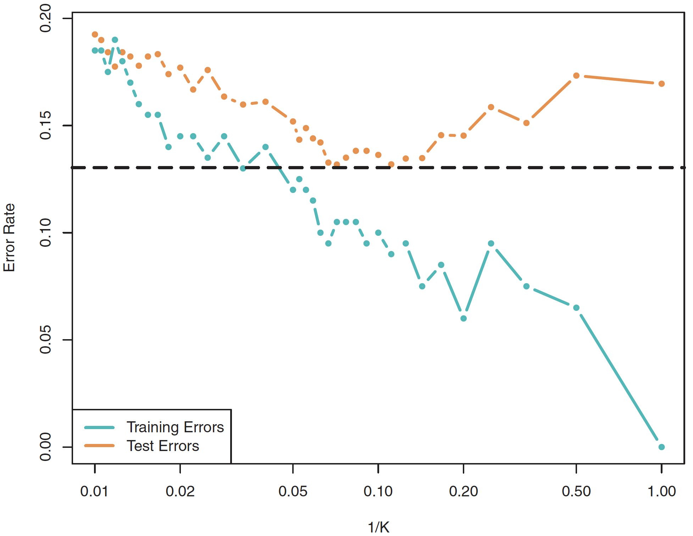

exclude: true

```{r, setup, include = F}
library(knitr)
library(tidyverse)
library(DT)
library(huxtable)
# Define colors
red_pink   = "#e64173"
turquoise  = "#20B2AA"
orange     = "#FFA500"
red        = "#fb6107"
blue       = "#181485"
navy       = "#150E37FF"
green      = "#8bb174"
yellow     = "#D8BD44"
grey_light = "grey70"
grey_mid   = "grey50"
grey_dark  = "grey20"
purple     = "#6A5ACD"
slate      = "#314f4f"
# Knitr options
opts_chunk$set(
  comment = "#>",
  fig.align = "center",
  fig.height = 7,
  fig.width = 10.5,
  cache = T,
  warning = F,
  message = F
)
opts_chunk$set(dev = "svg")
options(device = function(file, width, height) {
  svg(tempfile(), width = width, height = height)
})
options(knitr.table.format = "html")
```

---

# Table of contents

1. [Classification](#intro)

1. [Logistic regression](#logistic)

1. [*k*-nearest neighbors](#knn)

1. [Model assessment](#assessment)

1. [Decision trees](#trees)

1. [Wrap-up](#end)

---
layout: true
# Classification

---
class: inverse, middle

---
name: intro

.attn[Regression problems] seek to predict the number an outcome will take.

.attn[Classification problems] instead seek to predict the category of an outcome.

**Examples:**

- Using life/criminal history (and demographics?):<br>Can we predict whether a defendant is .b[granted bail]?

--

- Based upon a set of symptoms and observations:<br>Can we predict a patient's .b[medical condition](s)?

--

- From the pixels in an image:<br>Can we classify images as .b[chihuahua or blueberry muffin]?

---
layout: false
class: clear

```{R, pic chihuahua, echo = F, out.width = '72%'}
include_graphics("images/chihuahua-muffin.jpg")
```

---
layout: true
# Classification
## Why not regression?

---
name: no-regress

Regression methods are not made to deal with .b[multiple categories].

.ex[Ex.] Consider three medical diagnoses: .pink[stroke], .purple[overdose], and .orange[seizure].

Regression needs a numeric outcome—how should we code our categories?

$$Y=\begin{cases}
  \displaystyle 1 & \text{if }\color{#e64173}{\text{ stroke}} \\
  \displaystyle 2 & \text{if }\color{#6A5ACD}{\text{ overdose}} \\
  \displaystyle 3 & \text{if }\color{#FFA500}{\text{ seizure}} \\
\end{cases}$$

The categories' ordering is unclear—let alone the actual valuation.


---
name: lpm

In .b[binary outcome] cases, we .it[can] apply linear regression.

These models are called .attn[linear probability models] (LPMs).

The .b[predictions] from an LPM

1. estimate the conditional probability $y_i = 1$, _i.e._, $\mathop{\text{Pr}}\left(y_o = 1 \mid x_o\right)$

1. are not restricted to being between 0 and 1

1. provide an ordering—and a reasonable estimate of probability

---
layout: true
class: clear, middle

---

Let's consider an example: the `Default` dataset from `ISLR`

```{r, datatable-default, echo = F, cache = T, eval=T}
set.seed(1)
ISLR::Default %>% sample_n(100) %>% datatable(
  rownames = F,
  options = list(dom = 't')
) %>% formatRound(columns = 3:4, digits = c(2, 0))
```

---
exclude: true

```{r, clean-default-data, include = F}
# Clean data
default_df = ISLR::Default %>% dplyr::mutate(i_default = 1 * (default == "Yes"))
```

---

.hi-purple[The data:] The outcome, default, only takes two values (only `r default_df$i_default %>% mean() %>% scales::percent(accuracy = 0.1)` default).

```{r, boxplot-default-balance, echo = F, cache = T}
ggplot(data = default_df, aes(x = default, y = balance)) +
geom_boxplot(outlier.shape = NA, fill = "grey90") +
geom_jitter(width = 0.2, alpha = 0.1, color = purple) +
xlab("Default") +
scale_y_continuous("Balance", labels = scales::comma) +
theme_minimal(base_size = 20, base_family = "Fira Sans Book") +
coord_flip()
```

---


.hi-purple[The data:] The outcome, default, only takes two values (only `r default_df$i_default %>% mean() %>% scales::percent(accuracy = 0.1)` default).

```{r, plot-default-points, echo = F, cache = T}
# Plot points
ggplot(data = default_df, aes(x = balance, y = i_default)) +
geom_point(alpha = 0.05, size = 3.5, color = purple) +
geom_line(stat = "smooth", color = NA, method = lm, size = 1.5) +
scale_y_continuous("Default") +
scale_x_continuous("Balance", labels = scales::comma) +
theme_minimal(base_size = 20, base_family = "Fira Sans Book")
```
---

.hi-pink[The linear probability model] struggles with prediction in this setting.

```{r, plot-default-lpm, echo = F, cache = T}
ggplot(data = default_df, aes(x = balance, y = i_default)) +
geom_point(alpha = 0.05, size = 3.5, color = purple) +
geom_line(stat = "smooth", color = red_pink, method = lm, size = 1.5) +
scale_y_continuous("Default") +
scale_x_continuous("Balance", labels = scales::comma) +
theme_minimal(base_size = 20, base_family = "Fira Sans Book")
```

---
layout: true
# Logistic regression

---
class: inverse, middle

---
name: logistic
## Intro

.attn[Logistic regression] .b[models the probability] that our outcome $Y$ belongs to a .b[specific category] (often whichever category we think of as `TRUE`).

--

For example, we just saw a graph where
$$
\begin{align}
  \mathop{\text{Pr}}\left(\text{Default} = \text{Yes} | \text{Balance}\right) = p(\text{Balance})
\end{align}
$$
we are modeling the probability of `default` as a function of `balance`.

--

We use the .b[estimated probabilities] to .b[make predictions], _e.g._,
- if $p(\text{Balance})\geq 0.5$, we could predict "Yes" for Default

---
name: logistic-logistic
## What's .it[logistic]?

We want to model probability as a function of the predictors $\left(\beta_0 + \beta_1 X\right)$.

.col-centered[
.hi-pink[Linear probability model]
<br>
.pink[linear] transform. of predictors

$$
\begin{align}
  p(X) = \beta_0 + \beta_1 X
\end{align}
$$
]

.col-centered[
.hi-orange[Logistic model]
<br>
.orange[logistic] transform. of predictors

$$
\begin{align}
  p(X) = \dfrac{e^{\beta_0 + \beta_1 X}}{1 + e^{\beta_0 + \beta_1 X}}
\end{align}
$$
]

.clear-up[
What does this .it[logistic function] $\left(\frac{e^x}{1+e^x}\right)$ do?
]

1. ensures predictions are between 0 $(x\rightarrow-\infty)$ and 1 $(x\rightarrow\infty)$

1. forces an S-shaped curve through the data

---
layout: false
class: clear, middle

.hi-orange[Logistic regression]'s predictions of $\mathop{p}(\text{Balance})$

```{r, plot-default-logistic-2, echo = F, cache = T}
ggplot(data = default_df, aes(x = balance, y = i_default)) +
geom_point(alpha = 0.05, size = 3.5, color = purple) +
geom_line(stat = "smooth", color = red_pink, method = lm, size = 1.5, alpha = 0.2) +
geom_line(stat = "smooth", color = orange, method = "glm", method.args = list(family = "binomial"), size = 1.5) +
scale_y_continuous("Default") +
scale_x_continuous("Balance", labels = scales::comma) +
theme_minimal(base_size = 20, base_family = "Fira Sans Book")
```


---
layout: true
# *k*-nearest neighbors

---
class: inverse, middle

---
name: knn
## Setup

*k*-nearest neighbors (KNN) simply assigns a category based upon the nearest $K$ neighbors' votes (their values).

--

.note[More formally:] Using the $K$ closest neighbors.super[.pink[†]] to test observation $\color{#6A5ACD}{\mathbf{x_0}}$, we calculate the share of the observations whose class equals $j$,
$$
\begin{align}
  \hat{\mathop{\text{Pr}}}\left(\mathbf{y} = j | \mathbf{X} = \color{#6A5ACD}{\mathbf{x_0}}\right) = \dfrac{1}{K} \sum_{i \in \mathcal{N}_0} \mathop{\mathbb{I}}\left( \color{#FFA500}{\mathbf{y}}_i = j \right)
\end{align}
$$
These shares are our estimates for the unknown conditional probabilities.

We then assign observation $\color{#6A5ACD}{\mathbf{x_0}}$ to the class with the highest probability.

.footnote[
.pink[†] In $\color{#6A5ACD}{\mathbf{X}}$ space, a.k.a. Euclidean distance.
]
---
name: knn-fig
layout: false
class: clear, middle

.b[KNN in action]
<br>.note[Left:] K=3 estimation for "x". .note[Right:] KNN decision boundaries.
```{R, fig knn, echo = F}
include_graphics("images/isl-knn.png")
```
.smaller.it[Source: ISL]
---
class: clear, middle

The choice of K is very important—ranging from super flexible to inflexible.
---
class: clear, middle
.b[KNN error rates], as K increases
```{R, fig knn error, echo = F, out.width = '85%'}

```
.smaller.it[Source: ISL]


---
layout: true
# Model assessment

---
class: inverse, middle

---
name: assessment

## Can't use MSE anymore

With categorical variables, MSE doesn't work—_e.g._,
.center[
$\color{#FFA500}{\mathbf{y}} - \hat{\color{#FFA500}{\mathbf{y}}} =$ .orange[(Chihuahua)] - .orange[(Blueberry muffin)] $=$ ...?
]

Clearly we need a different way to define model performance.

---

The most common approach is exactly what you'd guess...

.hi-slate[Training error rate] The share of training predictions that we get wrong.
$$
\begin{align}
  \dfrac{1}{n} \sum_{i=1}^{n} \mathbb{I}\!\left( \color{#FFA500}{y}_i \neq \hat{\color{#FFA500}{y}}_i \right)
\end{align}
$$
where $\mathbb{I}\!\left( \color{#FFA500}{y}_i \neq \hat{\color{#FFA500}{y}}_i \right)$ is an indicator function that equals 1 whenever our prediction is wrong.

--

.hi-pink[Test error rate] The share of test predictions that we get wrong.
.center[
Average $\mathbb{I}\!\left( \color{#FFA500}{y}_0 \neq \hat{\color{#FFA500}{y}}_0 \right)$ in our .hi-pink[test data]
]


---
name: how
## Example: the Default data

```{r include=FALSE}
est_logistic = glm(
  i_default ~ balance,
  family = "binomial",
  data = default_df
)
# Predictions on scale of response (outcome) variable
p_hat = predict(est_logistic, type = "response")
# Predict '1' if p_hat is greater or equal to 0.5
y_hat = as.numeric(p_hat >= 0.5)
```


Logistic regression (with only one predictor: balance) guesses `r mean(y_hat == default_df$i_default) %>% scales::percent(accuracy = 0.01)` of the observations correctly.

--
- Is this good?

--

- Remember that `r mean(default_df$i_default) %>% scales::percent(accuracy = 0.01)` of the observations actually defaulted. So we would get `r (1 - mean(default_df$i_default)) %>% scales::percent(accuracy = 0.01)` right by guessing "No" for everyone..super[.pink[†]]

.footnote[
.pink[†] This idea is called the .it[null classifier].
]

--
```{r, calc-sensitivity, include = F}
tmp_df = tibble(
  y = default_df$i_default,
  y_hat = y_hat,
  y_hat_base = 0
)
ex_sensitivity = tmp_df %>% filter(y == 1) %>% transmute(y == y_hat) %>% unlist() %>% mean()
ex_sensitivity_base = tmp_df %>% filter(y == 1) %>% transmute(y == y_hat_base) %>% unlist() %>% mean()
```

- We .it[did] guess `r ex_sensitivity %>% scales::percent(accuracy = 0.01)` of the defaults, which is clearer better than 0%.

--

.qa[Q] How can we more formally assess our model's performance?

.qa[A] All roads lead to the .attn[confusion matrix].

---
name: confusion
## The confusion matrix

The .attn[confusion matrix] is us a convenient way to display
<br>.hi-orange[correct] and .hi-purple[incorrect] predictions for each class of our outcome.

```{r, default-confusion-matrix, include = F, cache = F, eval=T}
# Create data frame
conf_df = data.frame(
  No = c("True Negative (TN)", "False Positive (FP)"),
  Yes = c("False Negative (FN)", "True Positive (TP)")
)
rownames(conf_df) = c("No", "Yes")
# Create the matrix
conf_mat = conf_df %>% hux() %>%
  add_rownames("") %>% 
  # add_colnames() %>%
  insert_row(c("", "Truth", "Truth"), after = 0) %>% merge_cells(1, 2:3) %>%
  insert_column(c("", "", "Prediction", "Prediction"), after = 0) %>% merge_cells(3:4, 1) %>%
  set_bold(1:2, everywhere, T) %>%
  set_bold(everywhere, 1:2, T) %>%
  set_align(1:2, 1:4, "center") %>%
  set_valign(3:4, 1, "middle") %>%
  set_top_border(3, 3:4, 1) %>%
  set_left_border(3:4, 3, 1)
# Change "1" hanging around in column names
conf_mat[2,2] = ""
```

```{r, cm-right-wrong, echo = F, eval = T}
conf_mat %>%
set_text_color(3,3,orange) %>%
set_text_color(3,4,purple) %>%
set_text_color(4,3,purple) %>%
set_text_color(4,4,orange)
```

--

The .attn[accuracy] of a method is the share of .orange[correct] predictions, _i.e._,
.center[
.b[Accuracy] = (.hi-orange[TN] + .hi-orange[TP]) / (.hi-orange[TN] + .hi-orange[TP] + .hi-purple[FN] + .hi-purple[FP])
]

--

This matrix also helps display many other measures of assessment.

---
## The confusion matrix

.attn[Sensitivity:] the share of positive outcomes $Y=1$ that we correctly predict.

.center[
.b[Sensitivity] = .hi-orange[TP] / (.hi-orange[TP] + .hi-purple[FN])
]

```{r, cm-sensitivity, echo = F, eval = T}
conf_mat %>%
set_text_color(2:4,4,purple) %>%
set_text_color(4,4,orange)
```

Sensitivity is also called .attn[recall] and the .attn[true-positive rate].

One minus sensitivity is the .attn[type-II error rate].
---
## The confusion matrix

.attn[Specificity:] the share of neg. outcomes $(Y=0)$ that we correctly predict.

.center[
.b[Specificity] = .hi-orange[TN] / (.hi-orange[TN] + .hi-purple[FP])
]

```{r, cm-specificity, echo = F, eval = T}
conf_mat %>%
set_text_color(2:4,3,purple) %>%
set_text_color(3,3,orange)
```

One minus specificity is the .attn[false-positive rate] or .attn[type-I error rate].

---
## The confusion matrix

.attn[Precision:] the share of predicted positives $(\hat{Y}=1)$ that are correct.

.center[
.b[Precision] = .hi-orange[TP] / (.hi-orange[TP] + .hi-purple[FP])
]

```{r, cm-precision, echo = F, eval = T}
conf_mat %>%
set_text_color(4,2:4,purple) %>%
set_text_color(4,4,orange)
```

---
## Which criterion?

.qa[Q] So .it[which] criterion should we use?

--

.qa[A] You should use the .it[right] criterion for your context.

- Are true positives more valuable than true negatives?
<br>.note[Sensitivity] will be key.


- Do you want to have high confidence in predicted positives?
<br>.note[Precision] is your friend

- Are all errors equal?
<br> .note[Accuracy] is perfect.

[There's a lot more](https://yardstick.tidymodels.org/reference/index.html), _e.g._, the .attn[F.sub[1] score] combines precision and sensitivity.


---
layout: true
# Decision trees

---
class: inverse, middle

---
name: trees
## Fundamentals

.attn[Decision trees]
- split the .it[predictor space] (our $\mathbf{X}$) into regions
- then predict the most-common value within a region

--

.attn[Decision trees]
1. work for .hi[both classification and regression]
1. are inherently .hi[nonlinear]
1. are relatively .hi[simple] and  .hi[interpretable]
1. often .hi[underperform] relative to competing methods, but
1. easily extend to .hi[very competitive ensemble methods] (*many* trees).super[🌲]

.footnote[
🌲 Though the ensembles will be much less interpretable.
]

---
layout: true
class: clear

---
exclude: true

```{r, data-default, include = F}
# Load 'Defualt' data from 'ISLR'
default_df = ISLR::Default %>% as_tibble()
```

---
.ex[Example:] .b[A simple decision tree] classifying credit-card default

```{r, tree-graph, echo = F, cache = T}
DiagrammeR::grViz("
digraph {

graph [layout = dot, overlap = false, fontsize = 14]

node [shape = oval, fontname = 'Fira Sans', color = Gray95, style = filled]
s1 [label = 'Bal. > 1,800']
s2 [label = 'Bal. < 1,972']
s3 [label = 'Inc. > 27K']

node [shape = egg, fontname = 'Fira Sans', color = Purple, style = filled, fontcolor = White]
l1 [label = 'No (98%)']
l4 [label = 'No (69%)']

node [shape = egg, fontname = 'Fira Sans', color = Orange, style = filled, fontcolor = White]
l2 [label = 'Yes (76%)']
l3 [label = 'Yes (59%)']

edge [fontname = 'Fira Sans', color = Grey70]
s1 -> l1 [label = 'F']
s1 -> s2 [label = 'T']
s2 -> s3 [label = 'T']
s2 -> l2 [label = 'F']
s3 -> l3 [label = 'T']
s3 -> l4 [label = 'F']
}
")
```

---
name: ex-partition

Let's see how the tree works
--
—starting with our data (default: .orange[Yes] .it[vs.] .purple[No]).

```{r, partition-base, include = F, cache = T}
gg_base = ggplot(
  data = default_df,
  aes(x = balance, y = income, color = default, alpha = default)
) +
geom_hline(yintercept = 0) +
geom_vline(xintercept = 0) +
geom_point(size = 2) +
scale_y_continuous("Income", labels = dollar) +
scale_x_continuous("Balance", labels = dollar) +
scale_color_manual("Defaulted:", values = c(purple, orange), labels = c("No", "Yes")) +
scale_alpha_manual("Defaulted:", values = c(0.1, 0.8), labels = c("No", "Yes")) +
theme_minimal(base_size = 20, base_family = "Fira Sans Book") +
theme(legend.position = "none")
```

```{r, plot-raw, echo = F}
gg_base
```

---

The .hi-pink[first partition] splits balance at $1,800.

```{r, plot-split1, echo = F, cache = T, dependson = c(-2)}
# Add the first split (to existing figure)
gg_base +
annotate(
  "segment",
  x = 1800, xend = 1800, y = -Inf, yend = Inf,
  color = red_pink, size = 1.2
)
```
---

The .hi-pink[second partition] splits balance at $1,972, (.it[conditional on bal. > $1,800]).

```{r, plot-split2, echo = F, cache = T, dependson = c(-3)}
gg_base +
annotate(
  "segment",
  x = 1800, xend = 1800, y = -Inf, yend = Inf,
  linetype = "longdash"
) +
annotate(
  "segment",
  x = 1972, xend = 1972, y = -Inf, yend = Inf,
  color = red_pink, size = 1.2
)
```
---

The .hi-pink[third partition] splits income at $27K .b[for] bal. between $1,800 and $1,972.

```{r, plot-split3, echo = F, cache = T, dependson = c(-4)}
gg_base +
annotate(
  "segment",
  x = 1800, xend = 1800, y = -Inf, yend = Inf,
  linetype = "longdash"
) +
annotate(
  "segment",
  x = 1972, xend = 1972, y = -Inf, yend = Inf,
  linetype = "longdash"
) +
annotate(
  "segment",
  x = 1800, xend = 1972, y = 27e3, yend = 27e3,
  color = red_pink, size = 1.2
)
```

---

These three partitions give us four .b[regions]...

```{r, plot-split3b, echo = F, cache = T, dependson = c(-5)}
gg_base +
annotate(
  "segment",
  x = 1800, xend = 1800, y = -Inf, yend = Inf,
  linetype = "longdash"
) +
annotate(
  "segment",
  x = 1972, xend = 1972, y = -Inf, yend = Inf,
  linetype = "longdash"
) +
annotate(
  "segment",
  x = 1800, xend = 1972, y = 27e3, yend = 27e3,
  linetype = "longdash"
) +
annotate("text",
  x = 900, y = 37500, label = expression(R[1]),
  size = 8, family = "Fira Sans Book"
) +
annotate("text",
  x = 1886, y = 5.1e4, label = expression(R[2]),
  size = 8, family = "Fira Sans Book"
) +
annotate("text",
  x = 1886, y = 1e4, label = expression(R[3]),
  size = 8, family = "Fira Sans Book"
) +
annotate("text",
  x = 2336, y = 37500, label = expression(R[4]),
  size = 8, family = "Fira Sans Book"
)
```
---

.b[Predictions] cover each region (_e.g._, using the region's most common class).

```{r, plot-split3c, echo = F, cache = T, dependson = c(-6)}
gg_base +
annotate(
  "rect",
  xmin = 0, xmax = 1800, ymin = 0, ymax = Inf,
  fill = purple, alpha = 0.3
) +
annotate(
  "segment",
  x = 1800, xend = 1800, y = -Inf, yend = Inf,
  linetype = "longdash"
) +
annotate(
  "segment",
  x = 1972, xend = 1972, y = -Inf, yend = Inf,
  linetype = "longdash"
) +
annotate(
  "segment",
  x = 1800, xend = 1972, y = 27e3, yend = 27e3,
  linetype = "longdash"
)
```
---

.b[Predictions] cover each region (_e.g._, using the region's most common class).

```{r, plot-split3d, echo = F, cache = T, dependson = c(-7)}
gg_base +
annotate(
  "rect",
  xmin = 0, xmax = 1800, ymin = 0, ymax = Inf,
  fill = purple, alpha = 0.3
) +
annotate(
  "rect",
  xmin = 1800, xmax = 1972, ymin = 27e3, ymax = Inf,
  fill = orange, alpha = 0.3
) +
annotate(
  "segment",
  x = 1800, xend = 1800, y = -Inf, yend = Inf,
  linetype = "longdash"
) +
annotate(
  "segment",
  x = 1972, xend = 1972, y = -Inf, yend = Inf,
  linetype = "longdash"
) +
annotate(
  "segment",
  x = 1800, xend = 1972, y = 27e3, yend = 27e3,
  linetype = "longdash"
)
```
---

.b[Predictions] cover each region (_e.g._, using the region's most common class).

```{r, plot-split3e, echo = F, cache = T, dependson = c(-8)}
gg_base +
annotate(
  "rect",
  xmin = 0, xmax = 1800, ymin = 0, ymax = Inf,
  fill = purple, alpha = 0.3
) +
annotate(
  "rect",
  xmin = 1800, xmax = 1972, ymin = 27e3, ymax = Inf,
  fill = orange, alpha = 0.3
) +
annotate(
  "rect",
  xmin = 1800, xmax = 1972, ymin = 0, ymax = 27e3,
  fill = purple, alpha = 0.3
) +
annotate(
  "segment",
  x = 1800, xend = 1800, y = -Inf, yend = Inf,
  linetype = "longdash"
) +
annotate(
  "segment",
  x = 1972, xend = 1972, y = -Inf, yend = Inf,
  linetype = "longdash"
) +
annotate(
  "segment",
  x = 1800, xend = 1972, y = 27e3, yend = 27e3,
  linetype = "longdash"
)
```
---

.b[Predictions] cover each region (_e.g._, using the region's most common class).

```{r, plot-split3f, echo = F, cache = T, dependson = c(-9)}
gg_base +
annotate(
  "rect",
  xmin = 0, xmax = 1800, ymin = 0, ymax = Inf,
  fill = purple, alpha = 0.3
) +
annotate(
  "rect",
  xmin = 1800, xmax = 1972, ymin = 27e3, ymax = Inf,
  fill = orange, alpha = 0.3
) +
annotate(
  "rect",
  xmin = 1800, xmax = 1972, ymin = 0, ymax = 27e3,
  fill = purple, alpha = 0.3
) +
annotate(
  "rect",
  xmin = 1972, xmax = Inf, ymin = 0, ymax = Inf,
  fill = orange, alpha = 0.3
) +
annotate(
  "segment",
  x = 1800, xend = 1800, y = -Inf, yend = Inf,
  linetype = "longdash"
) +
annotate(
  "segment",
  x = 1972, xend = 1972, y = -Inf, yend = Inf,
  linetype = "longdash"
) +
annotate(
  "segment",
  x = 1800, xend = 1972, y = 27e3, yend = 27e3,
  linetype = "longdash"
)
```


---
layout: true
class: clear, middle

---
name: linearity

.qa[Q] How do trees compare to linear models?

.tran[.b[A] It depends how linear truth is.]

---

.qa[Q] How do trees compare to linear models?

.qa[A] It depends how linear the true boundary is.

---

.b[Linear boundary:] trees struggle to recreate a line.

```{r, fig-compare-linear, echo = F}
knitr::include_graphics("images/compare-linear.png")
```

.ex.small[Source: ISL, p. 315]

---

.b[Nonlinear boundary:] trees easily replicate the nonlinear boundary.

```{r, fig-compare-nonlinear, echo = F}
knitr::include_graphics("images/compare-nonlinear.png")
```

.ex.small[Source: ISL, p. 315]


---
layout: false
class: inverse, middle
name: end
# Wrap-up

---
# For the project

Let's recap the models you now have to work with:

For **regression** (continuous outcome variables):
- Linear regression with shrinkage/regularization
  - Ridge or lasso (tune $\lambda$)
  - Elasticnet (tune $\lambda$ and $\alpha$)
- *k*-nearest neighbors (`mode="regression"`; tune $k$)

For **classification** (categorical outcome variables):
- Logistic regression with shrinkage/regularization
  - Ridge, lasso, elasticnet (as above)
- *k*-nearest neighbors (`mode="classification"`; tune $k$)
- (We haven't covered how to tune decision trees.)

---
# Ensemble methods

If we try multiple *types* of models, how do we choose among them?
- You could just choose the one that performs best in cross-validation.
- But different methods have different strengths. The 2nd-best model may still have useful information.
- Often, the *best* prediction will **combine predictions from multiple models.**

Simple ensemble model:
- For **regression:** Take the average prediction across multiple models.
- For **classification:** Take the majority vote across multiple models.

---
# More advanced topics

If you go further in machine learning, you can learn about:

**Methods**
- Random forests (generalization of decision trees)
- Boosting and bagging
- Support vector machines
- Neural nets / deep learning
- Unsupervised learning

**Applications**
- Text analysis (natural language processing)
- Image (and video) processing

