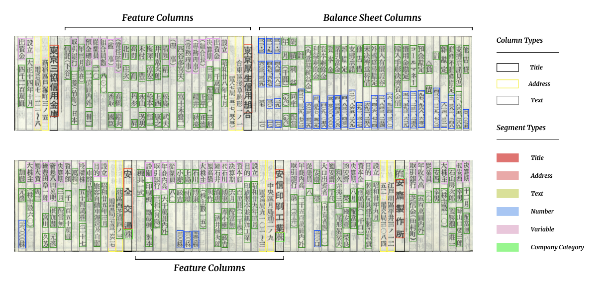
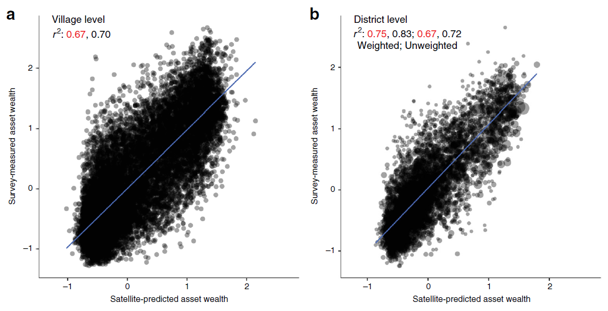
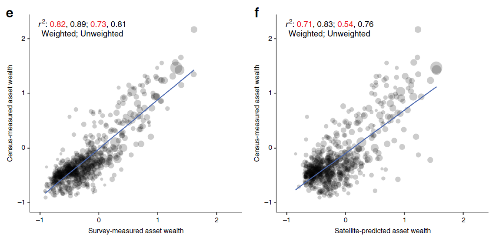
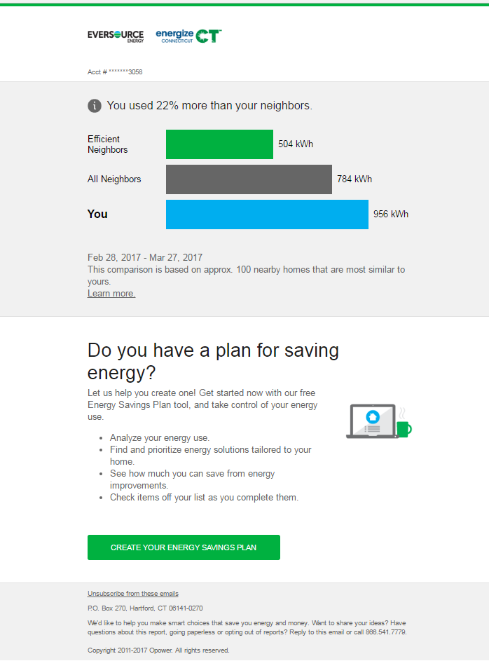

exclude: true

```{r, setup, include = F}
library(knitr)
# Define colors
red_pink   = "#e64173"
turquoise  = "#20B2AA"
orange     = "#FFA500"
red        = "#fb6107"
blue       = "#3b3b9a"
green      = "#8bb174"
grey_light = "grey70"
grey_mid   = "grey50"
grey_dark  = "grey20"
purple     = "#6A5ACD"
slate      = "#314f4f"
# Knitr options
opts_chunk$set(
  comment = "#>",
  fig.align = "center",
  fig.height = 7,
  fig.width = 10.5,
  cache = T,
  warning = F,
  message = F
)
opts_chunk$set(dev = "svg")
options(device = function(file, width, height) {
  svg(tempfile(), width = width, height = height)
})
options(knitr.table.format = "html")
```

---

# Economics applications of ML

**So, what can we use all these machine learning tools for?**

1. [Predicting outcomes](#outcomes), for their own sake

1. [Constructing new data](#newdata), as inputs to further research

1. [Selecting covariates](#selection) to estimate causal effects

1. [Predicting causal effects](#heterogeneity) (heterogeneous treatment effects)

--

This is an exploding area of research in economics. It's likely to expand even more in the next few years.

--

> .small["I believe that machine learning (ML) will have a dramatic impact on the field of economics within a short time frame. Indeed, the impact of ML on economics is already well underway." - Susan Athey (2019).]


---
layout: true
# Predicting outcomes

---
name: outcomes
class: inverse, middle
## (for their own sake)

---

Many opportunities for predictive models to potentially improve policy decisions:

- **Bail decisions:** Which criminal defendants are most likely to commit more crimes?

- **Environmental regulation:** When and where will illegal emissions occur?

- **Health care:** Is a patient having a heart attack, or something else?
  - Reducing under-diagnoses could improve patient outcomes.
  - Reducing over-diagnoses could reduce health care costs.

---

But be careful once you start using these for decisions with real stakes.

**Issue 1. The question you *really* want to answer may not be the one you *did* answer.**

- Seemingly reasonable approach:
  - Predict which factories are most likely to release illegal emissions.
  - Send inspectors to those factories more often.

- Will this reduce pollution?

--

  - Depends on the causal effect of inspections!

- We don't know whether the same factories that pollute more are the same ones that are likely to *respond* the most to being inspected.

---

But be careful once you start using these for decisions with real stakes.

**Issue 2. People might re-optimize once they learn your algorithm, ruining your predictive model.**

- If you shift pollution inspectors to new factories, the old factories might start polluting more.

- If you release defendants who own an iPhone, more criminals might start getting iPhones.

---

But be careful once you start using these for decisions with real stakes.

**Issue 3. Fairness, discrimination, and equity.** 

For the bail decision: How should we evaluate whether an algorithm is fair or discriminates on the basis of race?

--

1. Race is explicitly used as a variable in the algorithm, and white defendants are released at higher rates than black defendants.

--

1. Race is not explicitly used, but the algorithm still releases white defendants at higher rates than black defendants.

--

1. \#1, but the rates are more equal than the status quo.

--

1. \#2, and the rates are even less equal than the algorithm in \#1.

---

But be careful once you start using these for decisions with real stakes.

**Issue 3. Fairness, discrimination, and equity.**

- Some variables may be unethical (or illegal!) to use in prediction, depending on the purpose.

- Predictive models can easily reproduce patterns of bias found in society.
  - Given the far reaches of historical (and ongoing) discrimination, race can affect virtually any of your variables.
  - If race is a good predictor, excluding it will simply put more weight on other variables that proxy for race.
  - If your training data reflect discrimination, your model will too.


---

But be careful once you start using these for decisions with real stakes.

Kleinberg et al. (2017):

> "While machine learning can be valuable, realizing this value requires integrating these tools into an economic framework: being clear about the link between predictions and decisions; specifying the scope of payoff functions; and constructing unbiased decision counterfactuals."


---
layout: true
# Constructing new data

---
name: newdata
class: inverse, middle
## (as inputs to applied research)

---

**Examples:**

- Measuring people's emotions/sentiment from Twitter.
  - How does exceptionally hot (or cold) weather affect people's emotional states?

- Optical recognition of historical documents.

- Identifying crops from remote sensing data (satellite images).

- Measuring well-being/poverty from mobile data, satellite data, or Google Street View.

---

**Layout Parser** (from a team led by [Melissa Dell](https://dell-research-harvard.github.io/resources.html))
- A Python library that uses deep learning to convert document images into structured databases.

```{r, echo=F, out.width="90%"}
knitr::include_graphics("images/news_example.png")
```

---

**Layout Parser** (from a team led by [Melissa Dell](https://dell-research-harvard.github.io/resources.html))

Even works on 13th-century business records from Japan:

```{r, echo=F, out.width="100%"}

```


---

Local measurements of well-being are critical for public service delivery, but data is lacking across much of Africa. Can satellite data help?

.smallest[Yeh, Perez, Driscoll, Azzari, Tang, Lobell, Ermon, Burke (2020). ["Using publicly available satellite imagery and deep learning to understand economic well-being in Africa,"](https://www.nature.com/articles/s41467-020-16185-w) *Nature Communications*.]

```{r, echo=F, out.width="100%"}
knitr::include_graphics("images/yeh-fig1.png")
```

---

**What they do:**

Train a convolutional neural network ("deep learning") on daytime and nighttime satellite imagery.
- To predict asset-based wealth in household surveys ("ground truth").
- Landsat data: Daytime resolution of 1 pixel = 30m x 30m.
- (A *k*-nearest neighbors model on nighttime lights imagery performs nearly as well!)

---

Satellite-based predictions explain most of the variation in survey-based wealth.

But they pick up broad geographical trends (b: district) better than extremely local signals (a: village).

```{r, echo=F, out.width="90%"}

```

---

Satellite predictions don't perform too much worse than independent ground-based surveys.

```{r, echo=F, out.width="100%"}

```

---

Satellite predictions are less reliable at picking up *changes over time* as opposed to levels. (But they do still catch a good portion of the variation.)

```{r, echo=F, out.width="100%"}
knitr::include_graphics("images/yeh-fig4ab.png")
```


---
layout: true
# Selecting covariates

---
name: selection
class: inverse, middle
## (to estimate causal effects)

---
layout: true
# Selecting covariates

Want to use OLS to estimate the causal effect $\beta$ of $T_i$ on $y_i$:
$$y_i = \alpha + \beta T_i + (\gamma_1 x_1 + \gamma_2 x_2 + ...) + u_i$$

---

where $x_1, x_2, ...$ are control variables.

We don't actually care about the coefficients on the controls, only that we eliminate omitted variables bias (OVB) in $\hat{\beta}$.

**Many decisions to make:**
- Which control variables do we include?
- What functional form do they take?
- What if we have more possible control variables than observations?

---

**Cherry-picking & "the garden of forking paths"...**
- There are infinite possible sets of control variables.
- How do we know you didn't just choose the precise combination that leads you to the result you wanted?

**Why not throw in every possible control/transformation/interaction/etc?**
--

- Unnecessarily complicated - probably not all actually cause OVB.
- Might have more variables than observations - can't estimate it.
- Overfitting: might eat up "good" variation, make your $\hat{\beta}$ noisy or biased.

---

It would be nice to have a principled way to choose the control variables that "really matter".
- But this might sound like a familiar problem...

--

This is a job for the **lasso!**

---

### Post-double selection with Lasso

**Intuition:**
- Omitted variables bias comes from variables that are correlated with **both** $y$ and $T$.
  - So let's find the subset of controls that best predict $y$.
  - And also the subset of controls that best predict $T$.
- Then, we can include all the controls chosen in both models in the main regression.
--

- Or more conservatively: include all variables chosen in **either** model.

---

### Post-double selection with Lasso

**Actual procedure:**
1. Estimate a lasso regression of $y$ on all possible controls. Find the set of variables with non-zero coefficients.
2. Estimate a lasso regression of $T$ on all possible controls. Find the set of variables with non-zero coefficients.
3. Estimate an OLS regression of $y$ on $T$ and all the control variables chosen in either steps 1 or 2.

(Still need to tune the lasso penalty $\lambda$ through cross-validation!)

---

**Note: Lasso does not necessarily choose the "correct" control variables.**
- Don't take much meaning from which control variables it chooses.
  - Two models with completely different sets of controls can perform similarly in prediction.
- If a variable is chosen, it may or may not be responsible for omitted variables bias.
  - All we know is it is correlated with (is a good proxy for) the factors that do cause OVB.

---

**Note: Lasso is not a magic shortcut to causal inference.**
- To interpret $\beta$ causally, you still need a strong assumption.
  - That your set of controls includes all factors that could possibly affect both $T$ and $y$. Nothing is omitted or unobserved.
  - Still depends on how good your control variables are, and what else is going on in your situation.
- Lasso is just a **principled** way to select control variables.
  - Still best to combine it with a research design (IV, RD, diff-in-diff, randomization, etc.)

---

**Can we use other methods besides lasso?**
- Yes! Lasso is just the most common / best-understood method in economics so far.
- But Chernozhukov et al. (2018) discovered that you can use random forests or whatever else you like.
- General procedure:
  - In one half of your sample, form predictive models for $y$ and $T$.
  - In the other half, regress the prediction errors on each other: OLS of $(y-\hat{y})$ on $(T-\hat{T})$ to get $\hat{\beta}$.
- This is called **double/debiased machine learning.**
  - Causal inference as a problem of predicting counterfactuals.

---
layout: true
# Predicting causal effects

---
name: heterogeneity
class: inverse, middle
## (heterogeneous treatment effects)

---

Want to estimate the causal effect $\beta$ of $T_i$ on $y_i$:
$$y_i = \alpha + \beta T_i + u_i$$

But $\beta$ is just an *average* treatment effect...
- Different people may respond to the treatment in different ways.

Can we predict the **individual treatment effect** $\hat{\beta}_i$ for each person $i$?

---

Several approaches. Rough intuition for one:
$$y_i = \alpha + (\beta_0 + \beta_1 x_{1,i} + \beta_2 x_{2,i} + ...) \times T_i + u_i$$

- Some variables $X$ will be meaningfully predictive of an individual's (unobserved) treatment effect, but we don't know which ones.

- Could use lasso to find this set of $X$'s.

Active area of research. Random forests are commonly used.
- **Susan Athey** is a leader in this area (and all of ML+econ).

---

Application examples:

- **Targeting humanitarian assistance:** Which households are likely to benefit most from a cash transfer?

- **Evaluating or hiring teachers:** Which teachers have the greatest "value-added" to their students' learning?

- **Allocating organ donations:** Who is likely to live the longest with a transplant?


---
layout: true
# Using ML to target energy nudges

---

Knittel & Stolper (2019). ["Using Machine Learning to Target Treatment: The Case of Household Energy Use"](https://sstolper.github.io/website-stuff/Knittel_Stolper_2019_NBER.pdf).

Use **causal forests** to predict treatment effects of a "nudge" intended to reduce household electricity use.

- Analyze 15 randomized controlled trials (RCTs) conducted by Eversource, the largest electric utility in New England.

- Sample: 902,581 customers, monthly electricity consumption 2013-2018.

- Intervention: **Home Energy Reports** by Opower.

---
layout: false
class: clear

```{r, echo=F, out.width="60%"}

```

---
layout: true
# Using ML to target energy nudges

---

**Average treatment effect** across all experiments: 9 kWh/month, or **1%.**

```{r, echo=F, out.width="60%"}
knitr::include_graphics("images/ks-event-study.png")
```

Most impact evaluations stop here. But this is a huge experiment, so they can do more.

---
layout: false
class: clear

```{r, echo=F, out.width="65%"}
knitr::include_graphics("images/ks-tree.png")
```

---
layout: true
# Using ML to target energy nudges

---

Predicts lots of **heterogeneity in treatment effects** across households.

```{r, echo=F, out.width="90%"}
knitr::include_graphics("images/ks-te-distribution.png")
```

---

```{r, echo=F, out.width="100%"}
knitr::include_graphics("images/ks-predictors.png")
```

**Who responds most?**
--

High baseline consumption and low home values.

**Who *increases* energy use?**
--

Those with very low baseline consumption (social comparison may be backfiring - gives "permission" to use more).

---

**Can Eversource better target the Home Energy Reports?**

- Reports can save money and energy, but they have costs ($7/HH).

- Some households don't reduce energy enough to be worth it.

- If we can predict who they are, we can avoid sending them reports.

--

</br>

**Result:** Eversource can save up to **$1.2 million per year** by not sending reports to households with negative net benefits from the program.
- This savings is 25-66% of the program's total net benefits.

