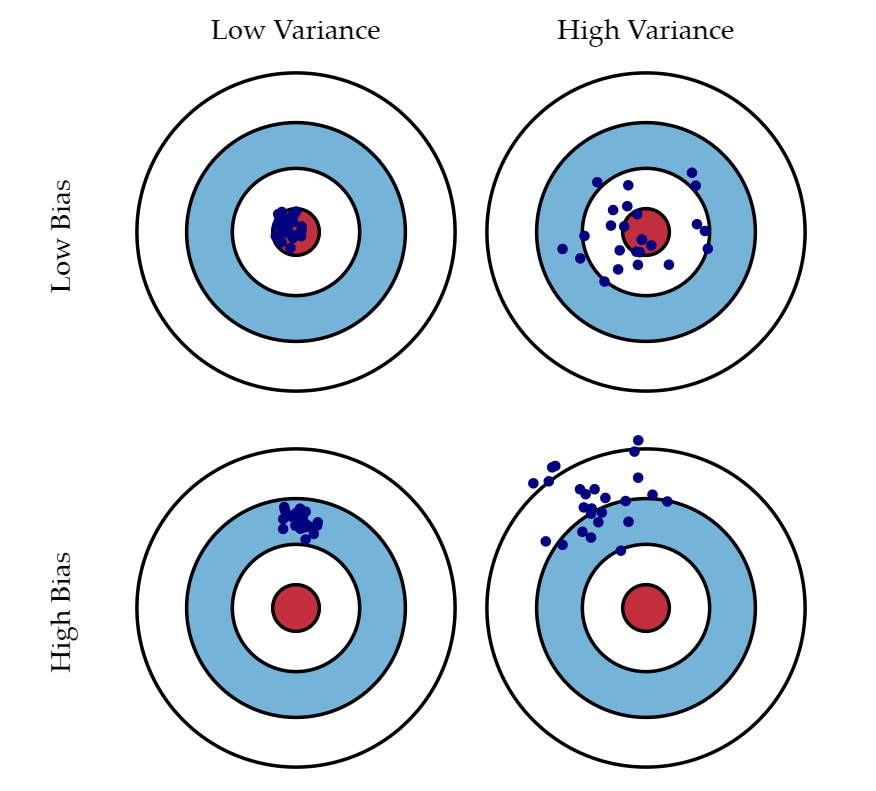

name: toc

```{css, echo=FALSE}
# CSS for including pauses in printed PDF output (see bottom of lecture)
@media print {
  .has-continuation {
    display: block !important;
  }
}
.remark-code-line {
  font-size: 95%;
}
.small {
  font-size: 75%;
}
.medsmall {
  font-size: 90%;
}
.scroll-output-full {
  height: 90%;
  overflow-y: scroll;
}
.scroll-output-75 {
  height: 75%;
  overflow-y: scroll;
}
```

```{r setup, include=FALSE}
options(htmltools.dir.version = FALSE)
library(knitr)
library(tidyverse)
knitr::opts_chunk$set(
	fig.align = "center",
	cache = TRUE,
	dpi = 300,
  warning = F,
  message = F
)
```

# Table of contents

1. [Getting to know your data](#first)

1. [Describing categorical variables](#categories)

1. [Describing distributions](#distributions)

1. [Data handling decisions](#decisions)


---
class: inverse, middle
name: first

# Getting to know your data

---

# Setup

Load the tidyverse if necessary:
```{r eval=FALSE}
library(tidyverse)
```

Download this data on hotel listings in Vienna, Austria in November 2017:
```{r}
vienna = read_csv("https://osf.io/y6jvb/download")
```

---

# First look

You already know these, but let's go over them:

```{r}
head(vienna)
```

---

# First look

.scroll-output-full[
```{r}
view(vienna)

summary(vienna)
```
]

---

# Better summaries with skimr

```{r, eval=F}
install.packages("skimr")
library(skimr)
skim(vienna)
```
.scroll-output-75[
  .small[
```{r echo=FALSE}
library(skimr)
skim(vienna)
```
  ]
]

---

# Better summaries with skimr

```{r, eval=F}
vienna %>% 
  mutate(stars = factor(stars)) %>%
  skim()
```
.scroll-output-75[
  .small[
```{r echo=FALSE}
vienna %>% 
  mutate(stars = factor(stars)) %>%
  skim()
```
  ]
]

---
class: inverse, middle
name: categories

# Describing categorical variables

---

# Frequency tables

Base R:

```{r}
table(vienna$stars, useNA="ifany")
```

</br>

Literally just the basics. Not terribly informative, well-formatted, or tidy.

---

# Frequency tables

Using the tidyverse (we've done this before):

```{r}
vienna %>% count(stars)
```

</br>

Advantage: output is a tibble; can be piped elsewhere.

---

# Frequency tables

Using `summarytools::freq`:

```{r, eval=F}
install.packages("summarytools")
```
```{r}
library(summarytools)
freq(vienna$stars)
```

---

# Frequency tables

Using `summarytools::freq`:

```{r, eval=F}
install.packages("summarytools")
```
```{r}
library(summarytools)
freq(vienna$stars, order="freq")
```

---

# Crosstabs (two-way frequency tables)

Using `summarytools::ctable`:

```{r}
ctable(vienna$city_actual, vienna$scarce_room)
```

Default percentages are out of each row. Options to make them by column or table.

--

Could we make a similar table with `dplyr` and `tidyr`?

---

# Crosstabs (two-way frequency tables)

Yes, but it's fairly complicated and not nicely formatted...

```{r message=FALSE}
vienna %>%
  group_by(city_actual, scarce_room) %>%
  summarize(n=n()) %>%
  mutate(percent = n/sum(n)) %>%
  pivot_wider(names_from=scarce_room, values_from=n:percent) %>%
  mutate(across(n_0:percent_1, replace_na, 0)) %>%
  rowwise %>%
  mutate(row_sum = sum(c_across(contains("n"))))

```

---

# Bar plots

We're going to use `ggplot2` to make graphs. Don't worry too much about the syntax yet; we'll talk about it more in the next unit, on visualization.

```{r, out.width="80%", fig.height=4}
ggplot(vienna, aes(y=neighbourhood)) + 
  geom_bar()
```


---
class: inverse, middle
name: distributions

# Describing distributions

---

# Histograms

With default settings:

```{r message=FALSE, warning=FALSE, out.width="80%", fig.height=4}
ggplot(vienna, aes(price)) + 
  geom_histogram()
```

---

# Histograms

Make bins line up with nice round numbers:

```{r, out.width="80%", fig.height=4, message=FALSE, warning=FALSE}
ggplot(vienna, aes(price)) + 
  geom_histogram(boundary=0, binwidth=25)
```

---

# Histograms

Too much detail? Use a larger bin width:

```{r, out.width="80%", fig.height=4, message=FALSE, warning=FALSE}
ggplot(vienna, aes(price)) + 
  geom_histogram(boundary=0, binwidth=100)
```

---

# Histograms

Want more detail? Use a smaller bin width:

```{r, out.width="80%", fig.height=4, message=FALSE, warning=FALSE}
ggplot(vienna, aes(price)) + 
  geom_histogram(boundary=0, binwidth=1)
```

---

# Kernel density plots

A smoothed version of a histogram.

```{r, out.width="80%", fig.height=4, message=FALSE, warning=FALSE}
ggplot(vienna, aes(rating)) + 
  geom_density()
```

---

# Kernel density plots

The **bandwidth** controls the degree of smoothing. Smaller:

```{r, out.width="80%", fig.height=4, message=FALSE, warning=FALSE}
ggplot(vienna, aes(rating)) + 
  geom_density(adjust=.25)
```

---

# Kernel density plots

The **bandwidth** controls the degree of smoothing. Larger:

```{r, out.width="80%", fig.height=4, message=FALSE, warning=FALSE}
ggplot(vienna, aes(rating)) + 
  geom_density(adjust=2)
```

---

# Kernel density plots

Show multiple groups:

```{r, out.width="80%", fig.height=4, message=FALSE, warning=FALSE}
vienna %>%
  mutate(stars_rounded = factor(round(stars))) %>%
  ggplot(aes(rating, color=stars_rounded)) + 
    geom_density(adjust=2)
```

---

# Kernel density plots

Show multiple groups:

```{r, out.width="80%", fig.height=4, message=FALSE, warning=FALSE}
vienna %>%
  mutate(stars_rounded = factor(round(stars))) %>%
  ggplot(aes(rating, fill=stars_rounded)) + 
    geom_density(adjust=2, alpha=0.4)
```

---

# Kernel density plots

When might you prefer a density plot vs. a histogram?

--

Histogram:
- Want to see your raw data as literally as possible
- Want to count extreme values
- Care about thresholds

Density plot:
- Want a more general idea of the distribution
- Want to compare distributions

---

# Kernel density plots

How does the smoothing work?

```{r, out.width="60%", echo=F}
include_graphics("img/kernel-density-animation.gif")
```
Source: [David Robinson](http://varianceexplained.org/files/bandwidth.html)

---

# Bias-variance tradeoff

Bandwidth choice illustrates a **bias-variance tradeoff**. Heuristically:

Smaller bandwidth:
- Less bias (more literal representation of your raw data).
- But higher variance (how meaningful are those wiggles?).

```{r echo=FALSE, out.width="80%", fig.height=4, message=FALSE, warning=FALSE}
ggplot(vienna, aes(rating)) + 
  geom_density(adjust=.25)
```

---

# Bias-variance tradeoff

Bandwidth choice illustrates a **bias-variance tradeoff**. Heuristically:

Larger bandwidth:
- Lower variance (smoother lines).
- But more bias (less directly showing your raw data).

```{r echo=FALSE, out.width="80%", fig.height=4, message=FALSE, warning=FALSE}
ggplot(vienna, aes(rating)) + 
  geom_density(adjust=2)
```

---

# Bias-variance tradeoff

Bias is not always bad! Often we want to accept some bias (inaccuracy) in exchange for less variance (more precision).

```{r, out.width="60%", echo=F}

```
Source: [Scott Fortmann-Roe](http://scott.fortmann-roe.com/docs/BiasVariance.html)

---
class: inverse, middle
name: decisions

# Data handling decisions


---

# Extreme values

There are a couple of really high prices in the `price` variable.

Our histogram would look a lot nicer if we could get rid of them...

```{r, out.width="80%", fig.height=4, message=FALSE, warning=FALSE}
ggplot(vienna, aes(price)) + 
  geom_histogram(boundary=0, binwidth=25)
ggplot(vienna, aes(distance)) + 
  geom_histogram()
```

---

# Extreme values

**Should we get rid of them? How do we decide?**

--

> 🗣I don’t know who needs to hear this but we ✨don’t✨ get rid of outliers *because* they’re extreme...<br><br>we get rid of them when their extreme-ness indicates they’re not a part of the data generating process we want to study (like a typo that says your newborn is 1000 lbs) </p>&mdash; Chelsea Parlett-Pelleriti (@ChelseaParlett) <a href="https://twitter.com/ChelseaParlett/status/1356285012375556109?ref_src=twsrc%5Etfw">February 1, 2021</a>

---

# Extreme values

Values that are much larger or smaller than the rest of your distribution, or that fail logical checks, should be investigated until you are able to classify them into one of these categories:
1. They are erroneous (and should be excluded).
2. They are part of a different data generating process (and should be excluded).
3. They are correct and produced by the same process as less extreme values (and should be retained).

Making sound judgments about extreme values requires **domain knowledge**.
- If you don't know yourself, it's time to ask someone else! Go back to the documentation of your raw data, or contact the person who collected or gave you the data.
- This can be one of the most labor-intensive aspects of data analysis, but it is critical to ensure good data quality and accurate conclusions.

---

# Extreme values

Even when extreme values are correct and truly belong to your distribution, they can exert inordinate influence on your analysis. Your results may reflect the extreme values more than the **central tendency** of your data.
- But this alone is not a reason to remove extreme values.
- Instead, it's a sign that you should consider applying a **transformation** to your variable.

---

# Transformations

Take a look at the `rating_count` variable.
```{r, out.width="80%", fig.height=4, message=FALSE, warning=FALSE}
ggplot(vienna, aes(rating_count)) +
  geom_histogram()
```

---

# Transformations

We can get a different view of this distribution by applying a (natural) logarithmic transformation:

```{r, out.width="80%", fig.height=4, message=FALSE, warning=FALSE}
vienna = mutate(vienna, ln_rating_count = log(rating_count))
ggplot(vienna, aes(ln_rating_count)) + 
  geom_histogram()
```

---

# Transformations

Now we can see finer differences among values in the left (bottom) of the distribution... at the expense of compressing values in the right (top) of the distribution. 

</br>

**Which should we prefer,** the raw variable or the log-transformed variable?

---

# Transformations

It depends on what you think are more important: **level** or **proportional differences**.
- Each tick on the raw histogram increases ratings by the same number.
- Each tick on the transformed histogram multiplies ratings by the same factor.

In other words, is this variable created by an **additive** or **multiplicative** process?

```{r echo=FALSE, fig.height=4, message=FALSE, warning=FALSE, out.width="80%"}
ggplot(vienna, aes(rating_count)) +
  geom_histogram() +
  scale_x_log10()
```

---

# Transformations

The natural log is by far the most common transformation in economics. Why?

- Many common and important variables follow approximately lognormal distributions (e.g., income, landholdings, trade quantities).

- Proportional changes in these variables often seem more policy-relevant than level changes (everyone's income increases by 2% vs. by $1000).

- It allows us to directly estimate elasticities, which we like because they're unitless and convenient in many theoretical models.

But other transformations can be used:
- Inverse hyperbolic sine, Box-Cox, square root, exponential.
- Normalization on the (0, 1) interval: max/min, sigmoidal, hyperbolic tangent.

---

# Transformations

One other common transformation: **z-score normalization.**

$$ z_i = \frac{x_i-\mu}{\sigma} $$

where $\mu$ is the variable's mean and $\sigma$ is its standard deviation.

- Centers the variable at 0.
- One unit of a z-score = one standard deviation.

In causal inference, often used for variables that have no intrinsic quantitative meaning.
- E.g., student test scores in education.

In prediction, often required for inputs to many machine learning algorithms.
- Avoids floating point problems by putting all variables on similar scales.

---

# Missing data

Best option: **Find it.** (The alternatives are not great...)

--

Try to figure out why the values are missing. Then choose one of these options:

**Delete** the observations with missing values.
- Most common choice in economics research.
- Caveat results as valid *for the nonmissing sample*.
- No problem at all under a "Missing Completely at Random" assumption (usually implausible).
- No real alternative if your outcome variable is missing.

**Impute** the values (using "multiple imputation" or Bayesian methods).
- Fill in the missing value, predicting it based on the values of other variables.
- Still relies on a "Missing at Random" assumption.
- Reasonably common for prediction problems.
- Rare in economics. For causal inference, can introduce new problems.

---

# Missing data

**Interpolate** the values between its neighbors in time or space.
- Time: Assume values change linearly (or exponentially) between observations.
  - Useful in panel data for control variables / predictors.
  - Example: Control for population in each year, but only have data every 10 years.
- Space: Assume values change smoothly in two spatial dimensions.
  - Inverse distance weighting; kriging (can be done using GIS tools)
  - Example: Fill in groundwater levels at every farm, but only have measurements at certain places.

**Create a flag** (binary variable) to indicate observations with missing values.
- Then replace the `NA`'s in the original variable with an unused value (`0`? `-999`?). This works so long as you always include both variables in the analysis.
- Allows you to keep the observation and not lose the rest of its information.
- Easy. Works well for both prediction and causal inference.


---
class: inverse, middle
name: challenge

# A brief challenge

---

# Challenge

Load this data:

```{r}
puzzle = read_csv("https://bit.ly/3B4BraF")
```

</br>

**Using your exploratory analysis skills, find the most important thing about this dataset.**


---

# Summary of Part 1

### Describing variables
* Get a initial **summary** of your dataset with `skimr::skim`.
* Explore categorical variables with **frequency tables** and **crosstabs.**
* For numerical variables, look at the **histograms** before you do anything else!
* The bandwidth of **kernel density** plots features a bias/variance tradeoff.

### Data handling decisions
* **Extreme values** call for scrutiny but should be excluded only if not created by the data generating process you want to study.
* Natural log **transformations** are widely useful for describing right-skewed variables.
* The least-bad way to handle **missing data** depends on your objectives.


```{r eval=FALSE, include=FALSE}
# Code to download unused data from Gabors Data Analysis.
# The full hotels_europe data
hotels_price = read_csv("https://osf.io/p6tyr/download")
hotels_features = read_csv("https://osf.io/utwjs/download")
hotels <- left_join(hotels_price, hotels_features, by = "hotel_id")
# Current Population Survey data
cps = read_csv("https://osf.io/4ay9x/download",
               col_types = cols(.default = "?", state = "c"))
```
